# C++ 高并发服务器模型实现

本项目实现了多种不同的后端服务器并发模型，展示了各种网络编程和并发处理技术。所有实现都使用 C++11 标准，不依赖第三方库。

## 支持的并发模型

### 1. SingleProcess (单进程模型)
- **文件**: `single_process_server.h`
- **特点**: 串行处理客户端请求，简单但性能有限
- **适用场景**: 学习和调试，低并发场景
- **优点**: 实现简单，资源消耗少
- **缺点**: 无法利用多核，一个请求阻塞会影响所有后续请求

**详细介绍**：
单进程模型是最简单的服务器架构，采用传统的阻塞I/O方式处理客户端请求。   
服务器在单个进程中运行，使用一个主循环来依次处理每个客户端连接。  
当有新连接到达时，服务器调用accept()接受连接，然后同步读取客户端数据、处理请求并发送响应。整个过程是串行的，一次只能处理一个客户端。  

**实现架构**：
- 核心实现基于传统的socket编程模式。
- 服务器创建监听socket并绑定到指定端口，然后进入无限循环等待连接。
- 每当accept()返回新的客户端socket时，服务器立即处理该连接的所有I/O操作，包括读取HTTP请求、解析协议、生成响应并发送数据。
- 由于采用阻塞I/O，每个操作都会等待完成后才继续下一步。

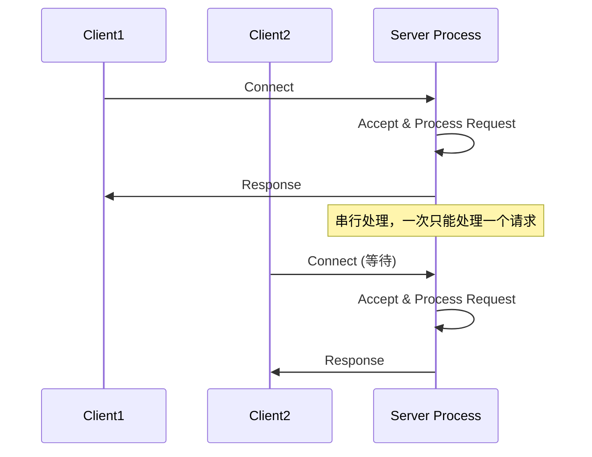
```mermaid
sequenceDiagram
    participant C1 as Client1
    participant C2 as Client2
    participant S as Server Process
    
    C1->>S: Connect
    S->>S: Accept & Process Request
    S->>C1: Response
    Note over S: 串行处理，一次只能处理一个请求
    C2->>S: Connect (等待)
    S->>S: Accept & Process Request
    S->>C2: Response
```

### 2. MultiProcess (多进程模型)
- **文件**: `multi_process_server.h`
- **特点**: 为每个客户端连接创建独立进程
- **适用场景**: 需要进程隔离的场景
- **优点**: 进程隔离，一个进程崩溃不影响其他
- **缺点**: 进程创建开销大，内存消耗高

**详细介绍**：
多进程模型通过为每个客户端连接创建独立的子进程来实现并发处理。  
主进程负责监听新连接，当accept()接受到新客户端时，立即调用fork()创建子进程来处理该连接，而主进程继续监听下一个连接。  
每个子进程拥有独立的内存空间和资源，可以并行处理不同的客户端请求。  
这种模型提供了最强的隔离性，一个进程的崩溃不会影响其他进程或主服务器。  

**实现架构**：
- 架构采用经典的fork-per-connection模式。
- 主进程创建监听socket后进入accept循环，每次接受新连接后立即fork()创建子进程。
- 子进程关闭监听socket，专门处理分配给它的客户端连接，完成所有I/O操作后退出。
- 主进程关闭客户端socket，继续监听新连接，并通过signal处理或waitpid()回收僵尸进程。

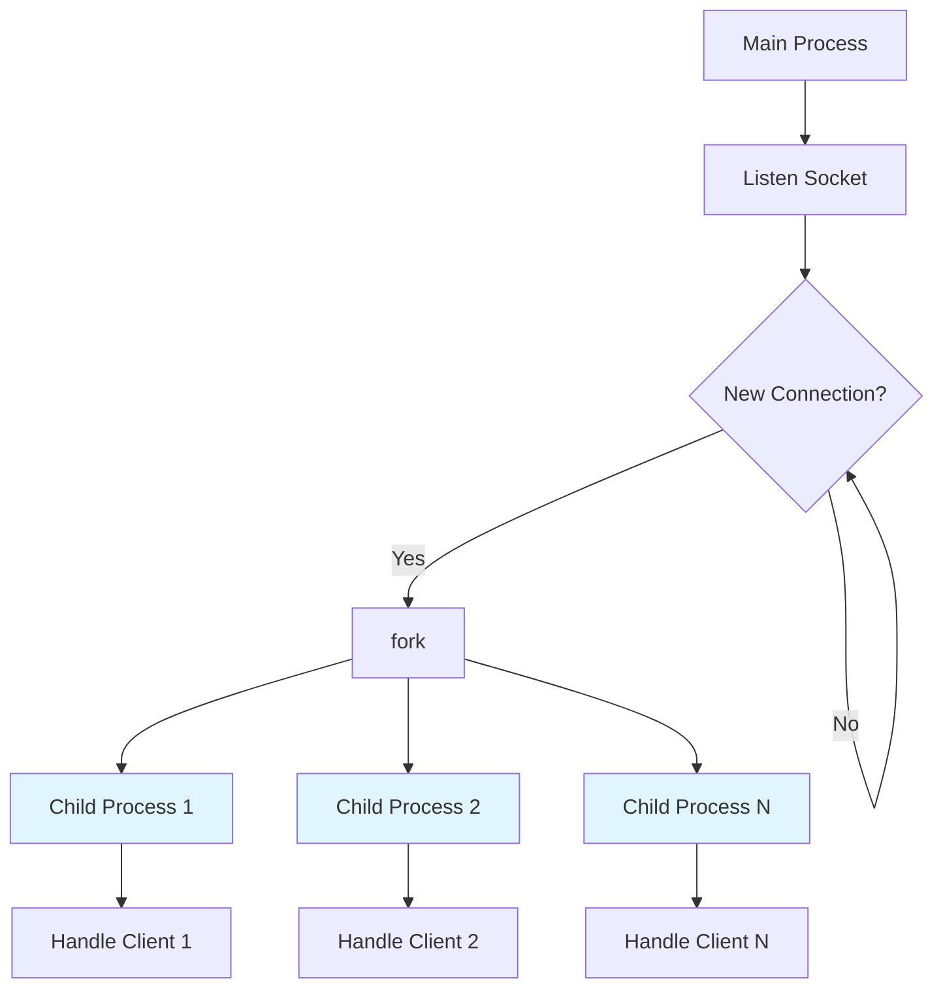
```mermaid
flowchart TD
    A[Main Process] --> B[Listen Socket]
    B --> C{New Connection?}
    C -->|Yes| D[fork]
    D --> E[Child Process 1]
    D --> F[Child Process 2]
    D --> G[Child Process N]
    E --> H[Handle Client 1]
    F --> I[Handle Client 2]
    G --> J[Handle Client N]
    C -->|No| C
    
    style E fill:#e1f5fe
    style F fill:#e1f5fe
    style G fill:#e1f5fe
```

### 3. MultiThread (多线程模型)
- **文件**: `multi_thread_server.h`
- **特点**: 为每个客户端连接创建一个新线程
- **适用场景**: 中等并发量的场景
- **优点**: 线程创建比进程快，共享内存空间
- **缺点**: 大量连接时线程数过多，上下文切换开销大

**详细介绍**：
多线程模型通过为每个客户端连接创建独立线程来实现并发处理。  
主线程负责监听和接受新连接，当有新客户端连接时，创建一个工作线程来处理该连接的所有I/O操作。  
所有线程共享同一个进程的内存空间，可以方便地共享数据和资源。  
相比多进程模型，线程的创建和切换开销更小，内存使用更高效。但需要特别注意线程安全问题，避免竞态条件和数据竞争。  

**实现架构**：
- 架构基于thread-per-connection模式。
- 主线程创建监听socket并进入accept循环，每接受一个新连接就调用pthread_create()或std::thread创建工作线程。
- 工作线程接收客户端socket描述符作为参数，独立处理该连接的读写操作，完成后自动退出。
- 为了避免线程泄漏，通常采用detached线程或在主线程中join回收。
- 共享资源（如日志、统计信息）需要使用互斥锁保护。

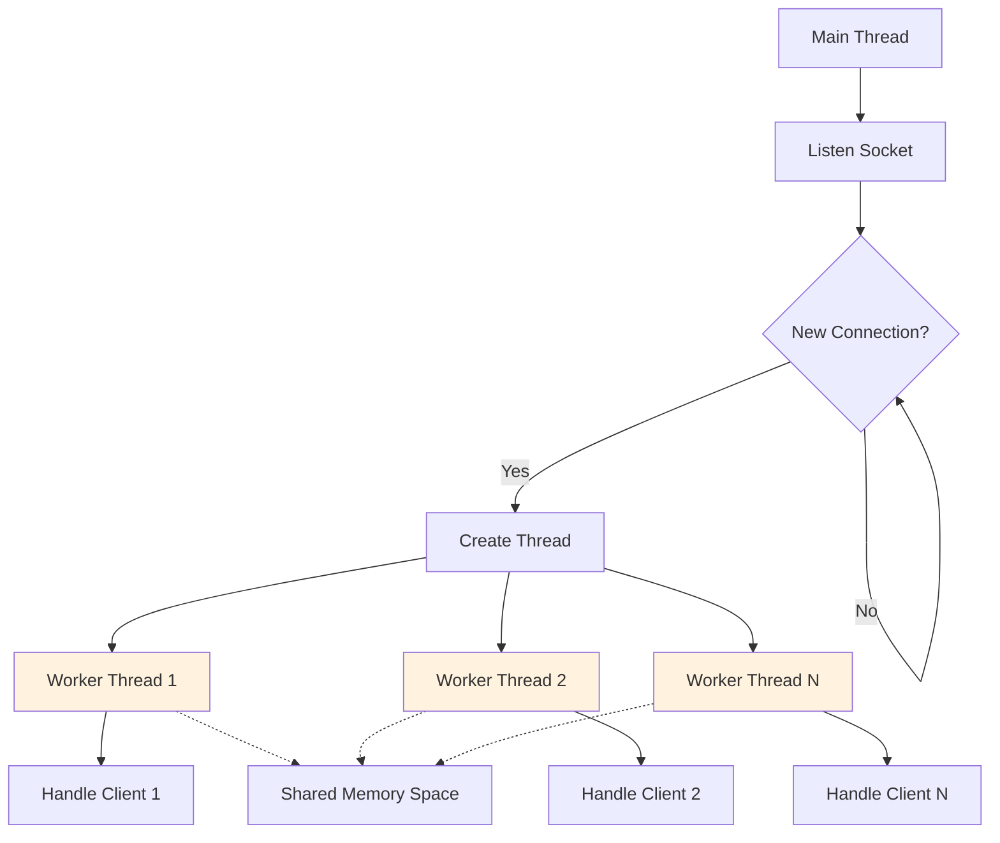
```mermaid
flowchart TD
    A[Main Thread] --> B[Listen Socket]
    B --> C{New Connection?}
    C -->|Yes| D[Create Thread]
    D --> E[Worker Thread 1]
    D --> F[Worker Thread 2]
    D --> G[Worker Thread N]
    E --> H[Handle Client 1]
    F --> I[Handle Client 2]
    G --> J[Handle Client N]
    C -->|No| C
    
    K[Shared Memory Space]
    E -.-> K
    F -.-> K
    G -.-> K
    
    style E fill:#fff3e0
    style F fill:#fff3e0
    style G fill:#fff3e0
```

### 4. ProcessPool1 (进程池模型1)
- **文件**: `process_pool1_server.h`
- **特点**: 预先创建固定数量的工作进程，共享监听socket
- **适用场景**: 高并发场景，需要进程隔离
- **优点**: 避免频繁创建进程，资源利用率高
- **缺点**: 进程间竞争accept可能不均匀

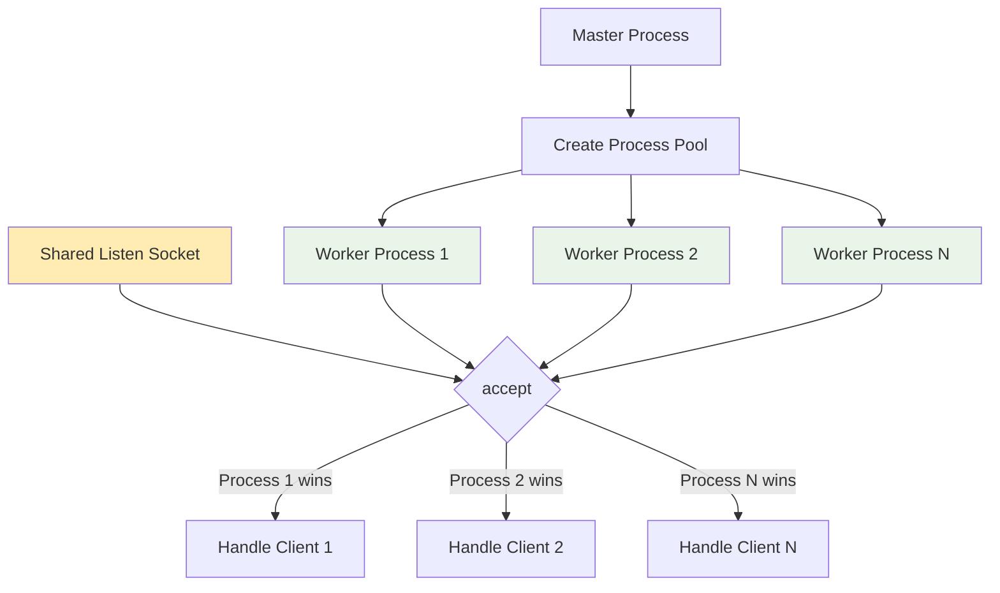
```mermaid
flowchart TD
    A[Master Process] --> B[Create Process Pool]
    B --> C[Worker Process 1]
    B --> D[Worker Process 2]
    B --> E[Worker Process N]
    
    F[Shared Listen Socket] --> G{accept}
    C --> G
    D --> G
    E --> G
    
    G -->|Process 1 wins| H[Handle Client 1]
    G -->|Process 2 wins| I[Handle Client 2]
    G -->|Process N wins| J[Handle Client N]
    
    style C fill:#e8f5e8
    style D fill:#e8f5e8
    style E fill:#e8f5e8
    style F fill:#ffecb3
```

### 5. ProcessPool2 (进程池模型2 - SO_REUSEPORT)
- **文件**: `process_pool2_server.h`
- **特点**: 使用SO_REUSEPORT选项，每个进程独立监听同一端口
- **适用场景**: Linux环境下的高并发场景
- **优点**: 内核负载均衡，避免惊群效应
- **缺点**: 依赖操作系统特性，可移植性有限

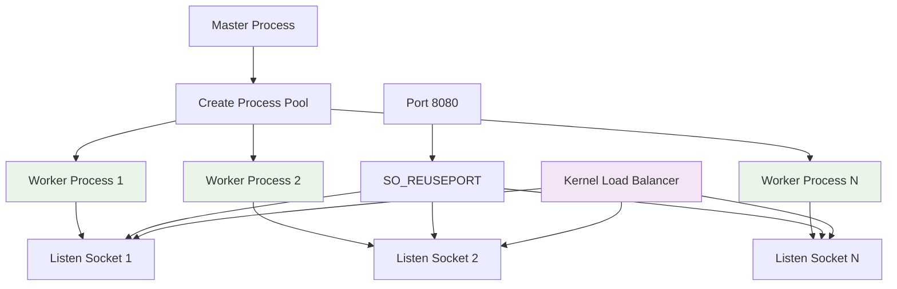
```mermaid
flowchart TD
    A[Master Process] --> B[Create Process Pool]
    B --> C[Worker Process 1]
    B --> D[Worker Process 2]
    B --> E[Worker Process N]
    
    F[Port 8080] --> G[SO_REUSEPORT]
    C --> H[Listen Socket 1]
    D --> I[Listen Socket 2]
    E --> J[Listen Socket N]
    
    G --> H
    G --> I
    G --> J
    
    K[Kernel Load Balancer] --> H
    K --> I
    K --> J
    
    style C fill:#e8f5e8
    style D fill:#e8f5e8
    style E fill:#e8f5e8
    style K fill:#f3e5f5
```

### 6. ThreadPool (线程池模型)
- **文件**: `thread_pool_server.h`
- **特点**: 预先创建固定数量的工作线程
- **适用场景**: 高并发Web服务器
- **优点**: 避免频繁创建线程，资源利用率高
- **缺点**: 线程数固定，可能无法适应负载变化

**详细介绍**：
线程池模型通过预先创建固定数量的工作线程来处理客户端请求，避免了为每个连接动态创建线程的开销。  
主线程负责接受新连接并将连接放入任务队列，工作线程从队列中取出任务进行处理。  
这种模型有效控制了系统资源使用，避免了线程数量无限增长导致的系统崩溃。  
线程池的大小通常根据CPU核心数和预期负载来设定，实现了更好的资源管理和性能优化。  

**实现架构**：
- 架构采用生产者-消费者模式。
- 系统启动时预创建指定数量的工作线程，这些线程在任务队列上等待。
- 主线程accept新连接后，将客户端socket封装成任务对象放入线程安全的任务队列中。
- 作线程通过条件变量等待任务，取到任务后处理完整的客户端交互流程。任务队列通常使用互斥锁和条件变量实现同步。
- 当工作线程处理完一个任务后，会将自己重新加入线程池，等待下一个任务。

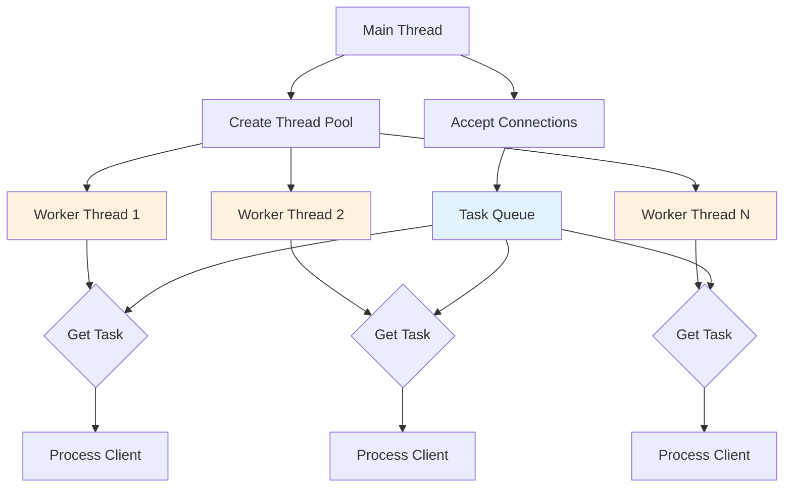
```mermaid
flowchart TD
    A[Main Thread] --> B[Create Thread Pool]
    B --> C[Worker Thread 1]
    B --> D[Worker Thread 2]
    B --> E[Worker Thread N]
    
    A --> F[Accept Connections]
    F --> G[Task Queue]
    
    C --> H{Get Task}
    D --> I{Get Task}
    E --> J{Get Task}
    
    G --> H
    G --> I
    G --> J
    
    H --> K[Process Client]
    I --> L[Process Client]
    J --> M[Process Client]
    
    style C fill:#fff3e0
    style D fill:#fff3e0
    style E fill:#fff3e0
    style G fill:#e3f2fd
```

### 7. LeaderAndFollower (领导者/跟随者模型)
- **文件**: `leader_follower_server.h`
- **特点**: 线程池变种，一个线程作为leader监听连接
- **适用场景**: 需要精确控制线程行为的场景
- **优点**: 减少线程间竞争，提高缓存局部性
- **缺点**: 实现复杂，调试困难

**详细介绍**：
领导者/跟随者模型是一种高性能的并发模式，通过动态角色切换来优化线程利用率。    
在任何时刻，只有一个线程担任领导者角色，负责监听和接受新的连接或事件，其他线程处于跟随者状态等待被激活。    
当领导者接收到事件后，它会将自己降级为跟随者去处理该事件，同时从跟随者中选举出新的领导者继续监听。    
这种模型避免了传统模型中的线程池调度开销，减少了线程间的竞争，提高了CPU缓存的局部性。特别适合高并发、低延迟的网络服务场景。    

**实现架构**：
- 架构基于线程池和角色管理机制构建。
- 系统维护一个线程池，其中一个线程担任领导者，其余线程为跟随者。
- 领导者线程负责在事件多路复用器（如epoll）上等待I/O事件。
- 当事件到达时，领导者首先从跟随者中选择一个线程提升为新领导者，然后自己降级为工作线程处理该事件，角色切换通过条件变量和互斥锁实现同步。
- 为了避免惊群效应，只有领导者线程在事件多路复用器上等待。
- 处理完事件的线程会重新加入跟随者队列等待下次被选为领导者。

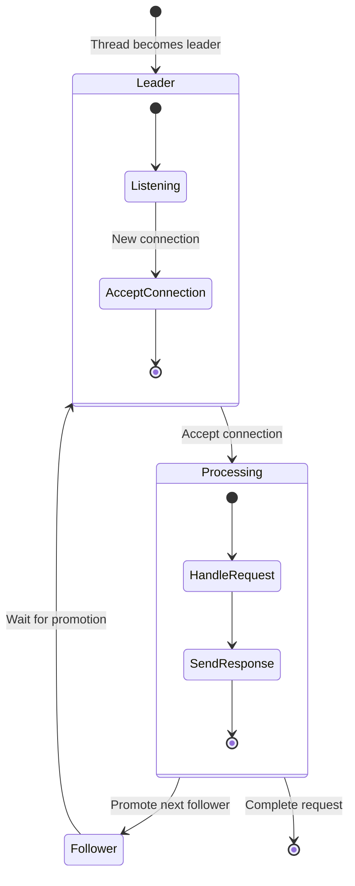
```mermaid
stateDiagram-v2
    [*] --> Leader: Thread becomes leader
    Leader --> Processing: Accept connection
    Processing --> Follower: Promote next follower
    Follower --> Leader: Wait for promotion
    Processing --> [*]: Complete request
    
    state Leader {
        [*] --> Listening
        Listening --> AcceptConnection: New connection
        AcceptConnection --> [*]
    }
    
    state Processing {
        [*] --> HandleRequest
        HandleRequest --> SendResponse
        SendResponse --> [*]
    }
```

### 8. Select (Select I/O多路复用)
- **文件**: `select_server.h`
- **特点**: 使用select系统调用监控多个文件描述符
- **适用场景**: 跨平台的中等并发场景
- **优点**: 跨平台兼容性好
- **缺点**: 文件描述符数量有限制，性能随连接数线性下降

**详细介绍**：
Select模型是最经典的I/O多路复用技术，通过select()系统调用在单线程中同时监控多个socket的状态变化。  
服务器维护读、写、异常三个文件描述符集合，select()会阻塞等待直到至少一个描述符就绪。  
当select()返回时，服务器遍历描述符集合，处理所有就绪的I/O操作。  
这种模型避免了多线程的复杂性，用单线程就能处理多个并发连接，是事件驱动编程的基础。  

**实现架构**：
- 架构基于事件循环模式。
- 服务器初始化时将监听socket加入读描述符集合，然后进入主循环调用select()等待事件。
- 当有新连接时，accept()后将客户端socket加入监控集合；当客户端socket可读时，读取并处理请求；当可写时，发送响应数据。
- 每次循环都需要重新设置描述符集合，因为select()会修改传入的集合。

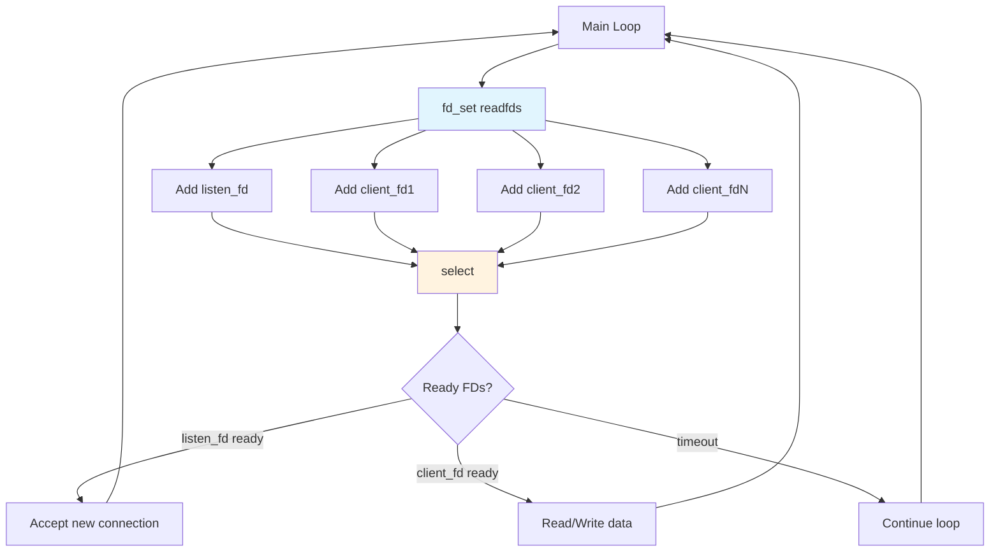
```mermaid
flowchart TD
    A[Main Loop] --> B[fd_set readfds]
    B --> C[Add listen_fd]
    B --> D[Add client_fd1]
    B --> E[Add client_fd2]
    B --> F[Add client_fdN]
    
    G[select] --> H{Ready FDs?}
    C --> G
    D --> G
    E --> G
    F --> G
    
    H -->|listen_fd ready| I[Accept new connection]
    H -->|client_fd ready| J[Read/Write data]
    H -->|timeout| K[Continue loop]
    
    I --> A
    J --> A
    K --> A
    
    style B fill:#e1f5fe
    style G fill:#fff3e0
```

### 9. Poll (Poll I/O多路复用)
- **文件**: `poll_server.h`
- **特点**: 使用poll系统调用，改进了select的限制
- **适用场景**: 中等并发场景
- **优点**: 没有文件描述符数量限制
- **缺点**: 性能仍随连接数线性下降

**详细介绍**：
Poll模型是select模型的改进版本，使用poll()系统调用来监控多个文件描述符的I/O事件。  
与select不同，poll使用pollfd结构数组来描述要监控的文件描述符和事件类型，没有FD_SETSIZE的限制，可以监控任意数量的描述符。  
poll()返回时，通过检查每个pollfd结构的revents字段来确定哪些描述符就绪。这种模型保持了select的单线程优势，同时解决了描述符数量限制问题。  

**实现架构**：
- 架构同样基于事件循环，但使用更灵活的数据结构。
- 服务器维护一个动态的pollfd数组，每个元素包含文件描述符、关注的事件和返回的事件。
- 主循环调用poll()等待事件，返回后遍历数组检查revents字段。
- 当有新连接时，动态扩展pollfd数组；当连接关闭时，从数组中移除对应元素。
- 相比select，poll的接口更清晰，不需要重复设置描述符集合。

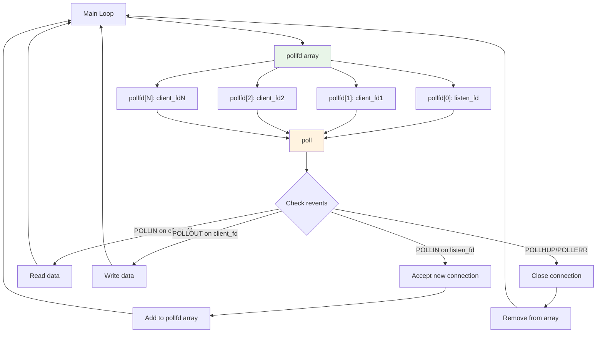
```mermaid
flowchart TD
    A[Main Loop] --> B[pollfd array]
    B --> C["pollfd[0]: listen_fd"]
    B --> D["pollfd[1]: client_fd1"]
    B --> E["pollfd[2]: client_fd2"]
    B --> F["pollfd[N]: client_fdN"]
    
    G[poll] --> H{Check revents}
    C --> G
    D --> G
    E --> G
    F --> G
    
    H -->|POLLIN on listen_fd| I[Accept new connection]
    H -->|POLLIN on client_fd| J[Read data]
    H -->|POLLOUT on client_fd| K[Write data]
    H -->|POLLHUP/POLLERR| L[Close connection]
    
    I --> M[Add to pollfd array]
    J --> A
    K --> A
    L --> N[Remove from array]
    M --> A
    N --> A
    
    style B fill:#e8f5e8
    style G fill:#fff3e0
```

### 10. Epoll (Epoll I/O多路复用)
- **文件**: `epoll_server.h`
- **特点**: Linux特有的高效I/O多路复用机制
- **适用场景**: Linux环境下的高并发场景
- **优点**: 性能优秀，支持边缘触发
- **缺点**: 仅限Linux系统

**详细介绍**：
Epoll是Linux内核提供的高性能I/O多路复用机制，专门为解决C10K问题而设计。    
与select/poll不同，epoll使用事件驱动的方式，只返回就绪的文件描述符，避免了线性扫描。    
Epoll内部使用红黑树管理文件描述符，使用就绪列表存储活跃事件，实现了O(1)的事件通知效率。
支持水平触发(LT)和边缘触发(ET)两种模式，为高性能服务器提供了极大的灵活性。   

**实现架构**：
- 架构基于epoll的三个核心系统调用：epoll_create创建epoll实例，epoll_ctl管理监控的文件描述符，epoll_wait等待事件。
- 服务器启动时创建epoll实例，将监听socket加入监控。主循环调用epoll_wait等待事件，只处理返回的就绪描述符，无需遍历所有连接。
- 新连接通过epoll_ctl添加到监控集合，关闭连接时移除。
- 支持EPOLLIN、EPOLLOUT、EPOLLET等多种事件类型。  

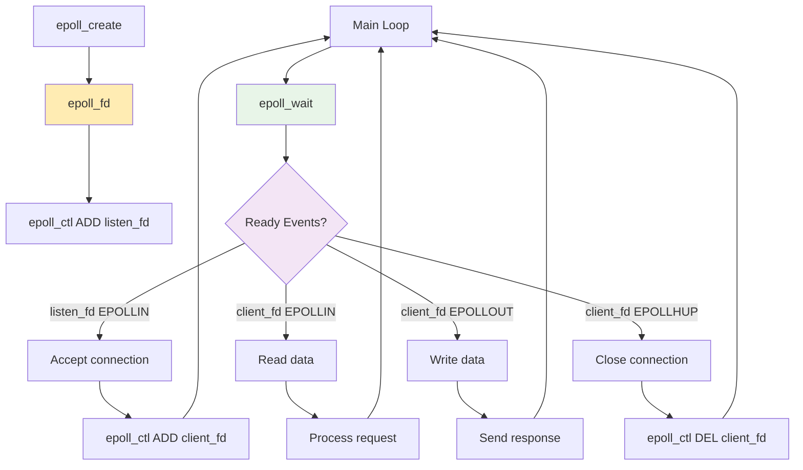
```mermaid
flowchart TD
    A[epoll_create] --> B[epoll_fd]
    B --> C[epoll_ctl ADD listen_fd]
    
    D[Main Loop] --> E[epoll_wait]
    E --> F{Ready Events?}
    
    F -->|listen_fd EPOLLIN| G[Accept connection]
    F -->|client_fd EPOLLIN| H[Read data]
    F -->|client_fd EPOLLOUT| I[Write data]
    F -->|client_fd EPOLLHUP| J[Close connection]
    
    G --> K[epoll_ctl ADD client_fd]
    H --> L[Process request]
    I --> M[Send response]
    J --> N[epoll_ctl DEL client_fd]
    
    K --> D
    L --> D
    M --> D
    N --> D
    
    style B fill:#ffecb3
    style E fill:#e8f5e8
    style F fill:#f3e5f5
```

### 11. Kqueue (Kqueue I/O多路复用)
- **文件**: `kqueue_server.h`
- **特点**: BSD/macOS特有的高效I/O多路复用机制
- **适用场景**: BSD/macOS环境下的高并发场景
- **优点**: 性能优秀，功能丰富
- **缺点**: 仅限BSD/macOS系统

**详细介绍**：
Kqueue是FreeBSD和macOS系统提供的高性能事件通知机制，类似于Linux的epoll但功能更强大。  
Kqueue不仅支持网络I/O事件，还支持文件系统变化、信号、定时器等多种事件类型。通过kevent()系统调用统一管理所有事件，提供了一致的编程接口。  
Kqueue使用内核事件队列，只通知发生变化的事件，避免了轮询开销。  
其设计哲学是提供统一的事件处理框架，让应用程序能够高效地响应各种系统事件。  

**实现架构**：
- 架构围绕kqueue()和kevent()两个核心系统调用构建。
- 服务器启动时调用kqueue()创建事件队列，然后使用kevent()注册感兴趣的事件（如监听socket的读事件）。
- 主循环调用kevent()等待事件，该函数既用于注册事件也用于获取就绪事件。
- 当有事件发生时，kevent()返回事件数组，包含事件类型、文件描述符、数据等信息。支持EVFILT_READ、EVFILT_WRITE、EVFILT_TIMER等多种过滤器。

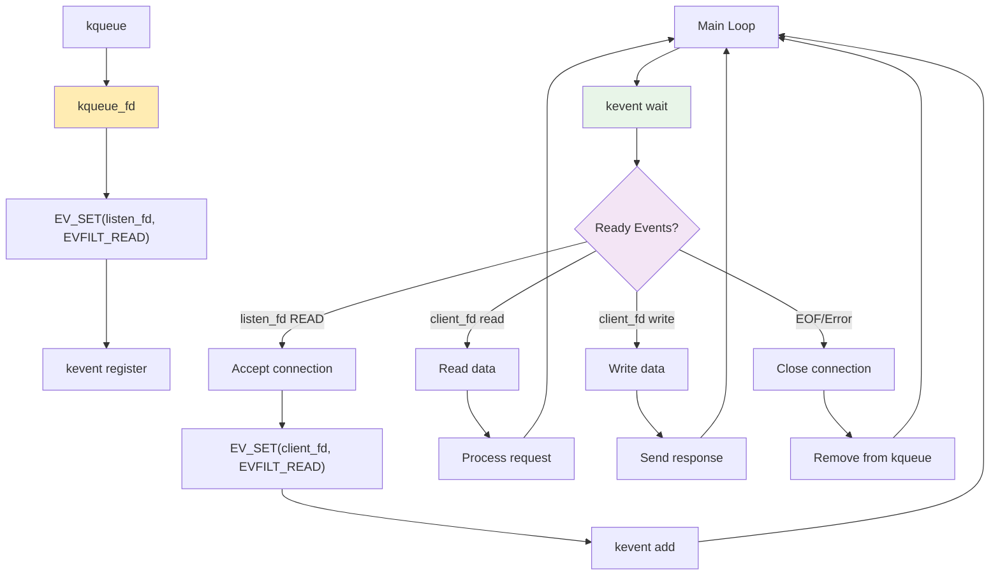
```mermaid
flowchart TD
    A[kqueue] --> B[kqueue_fd]
    B --> C["EV_SET(listen_fd, EVFILT_READ)"]
    C --> D[kevent register]
    
    E[Main Loop] --> F[kevent wait]
    F --> G{Ready Events?}
    
    G -->|listen_fd READ| H[Accept connection]
    G -->|client_fd read| I[Read data]
    G -->|client_fd write| J[Write data]
    G -->|EOF/Error| K[Close connection]
    
    H --> L["EV_SET(client_fd, EVFILT_READ)"]
    I --> M[Process request]
    J --> N[Send response]
    K --> O[Remove from kqueue]
    
    L --> P[kevent add]
    M --> E
    N --> E
    O --> E
    P --> E
    
    style B fill:#ffecb3
    style F fill:#e8f5e8
    style G fill:#f3e5f5
```

### 12. Reactor (Reactor模式)
- **文件**: `reactor_server.h`
- **特点**: 事件驱动的网络编程模式
- **适用场景**: 需要精确控制事件处理的场景
- **优点**: 结构清晰，易于扩展
- **缺点**: 实现复杂度较高

**详细介绍**：
Reactor模式是一种事件驱动的设计模式，将事件检测和事件处理分离，提供了高度可扩展的架构。    
该模式定义了一个事件循环，负责监听各种I/O事件，当事件发生时分发给相应的事件处理器。    
Reactor模式的核心思想是"不要调用我们，我们会调用你"，应用程序注册事件处理器，由Reactor负责在适当时机调用。    
这种模式广泛应用于网络编程框架，如Java NIO、Node.js等，提供了优雅的异步编程模型。  

**实现架构**：
- 架构包含几个核心组件：Reactor负责事件循环和分发，Demultiplexer负责I/O事件检测（如epoll/select），EventHandler定义事件处理接口，ConcreteHandler实现具体的业务逻辑。
- 服务器启动时，各种处理器注册到Reactor，指定关注的事件类型。
- Reactor进入事件循环，调用Demultiplexer等待事件，当事件就绪时查找对应的处理器并调用其处理方法。  
- 支持AcceptHandler处理新连接、ReadHandler处理读事件、WriteHandler处理写事件等。

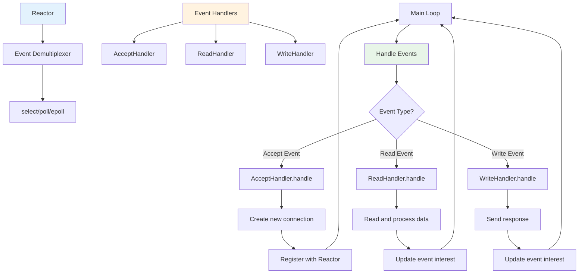
```mermaid
flowchart TD
    A[Reactor] --> B[Event Demultiplexer]
    B --> C[select/poll/epoll]
    
    D[Event Handlers] --> E[AcceptHandler]
    D --> F[ReadHandler]
    D --> G[WriteHandler]
    
    H[Main Loop] --> I[Handle Events]
    I --> J{Event Type?}
    
    J -->|Accept Event| K[AcceptHandler.handle]
    J -->|Read Event| L[ReadHandler.handle]
    J -->|Write Event| M[WriteHandler.handle]
    
    K --> N[Create new connection]
    L --> O[Read and process data]
    M --> P[Send response]
    
    N --> Q[Register with Reactor]
    O --> R[Update event interest]
    P --> S[Update event interest]
    
    Q --> H
    R --> H
    S --> H
    
    style A fill:#e3f2fd
    style D fill:#fff3e0
    style I fill:#e8f5e8
```

### 13. Coroutine (协程模式)
- **文件**: `coroutine_server.h`
- **特点**: 使用状态机模拟协程行为（C++11兼容）
- **适用场景**: 异步处理场景
- **优点**: 内存消耗少，上下文切换快
- **缺点**: 实现复杂，调试困难

**详细介绍**：
协程模式通过状态机模拟协程行为，在C++11环境下实现异步编程。与传统的回调方式不同，协程允许函数在执行过程中暂停并在稍后恢复，使异步代码看起来像同步代码。    
本实现使用状态机来跟踪每个连接的处理状态，当遇到会阻塞的I/O操作时，协程会yield让出控制权，等待I/O就绪后再resume继续执行。    
这种模型特别适合处理大量并发连接，因为协程的内存开销远小于线程，可以创建成千上万个协程而不会耗尽系统资源。  

**实现架构**：
- 架构基于状态机和事件循环构建。
- 每个客户端连接对应一个协程对象，包含当前状态、上下文数据和状态转换逻辑。协程调度器维护所有活跃协程的列表，在事件循环中轮询I/O事件。
- 当socket就绪时，调度器恢复对应协程的执行。
- 协程内部使用状态机实现：INIT状态初始化连接，READING状态处理读取，PROCESSING状态处理业务逻辑，WRITING状态发送响应，DONE状态清理资源。
- 每个状态都可能因为I/O阻塞而yield，调度器会在下次循环中检查并恢复。

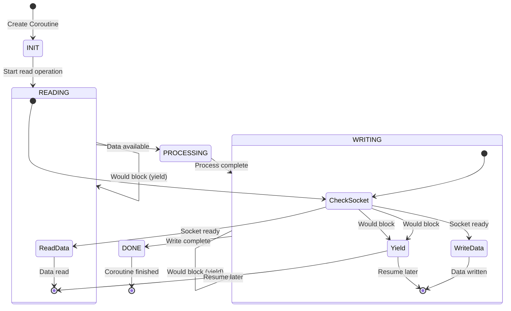
```mermaid
stateDiagram-v2
    [*] --> INIT: Create Coroutine
    INIT --> READING: Start read operation
    READING --> PROCESSING: Data available
    READING --> READING: Would block (yield)
    PROCESSING --> WRITING: Process complete
    WRITING --> WRITING: Would block (yield)
    WRITING --> DONE: Write complete
    DONE --> [*]: Coroutine finished
    
    state READING {
        [*] --> CheckSocket
        CheckSocket --> ReadData: Socket ready
        CheckSocket --> Yield: Would block
        ReadData --> [*]: Data read
        Yield --> [*]: Resume later
    }
    
    state WRITING {
        [*] --> CheckSocket
        CheckSocket --> WriteData: Socket ready
        CheckSocket --> Yield: Would block
        WriteData --> [*]: Data written
        Yield --> [*]: Resume later
    }
```

### 14. Actor模型
- **文件**: `actor_server.h`
- **特点**: 每个Actor是独立的计算单元，通过消息传递通信
- **适用场景**: 分布式系统、高并发消息处理
- **优点**: 无共享状态，天然避免竞态条件
- **缺点**: 实现复杂，消息传递开销
- **实现**: 可以基于线程池 + 消息队列实现

**详细介绍**：
Actor模型是一种基于消息传递的并发计算模型，每个Actor都是独立的计算单元，拥有自己的状态和行为。    
Actor之间不共享内存，只能通过异步消息进行通信。    
当Actor接收到消息时，可以执行三种操作：处理消息并更新内部状态、向其他Actor发送消息、创建新的Actor。    
这种模型天然避免了传统并发编程中的锁和竞态条件问题，提供了更安全的并发处理方式。    
Actor模型特别适合构建分布式系统，因为Actor可以分布在不同的机器上，通过网络进行消息传递。    

**实现架构**：
- 架构围绕Actor、消息队列和调度器构建。  
- 每个Actor包含邮箱（消息队列）、状态数据和消息处理逻辑。  
- 系统启动时创建多个Worker Actor处理客户端请求，一个Acceptor Actor负责接受新连接。  
- 当有新连接时，Acceptor发送消息给负载最轻的Worker。  
- Worker Actor接收到连接消息后，负责该连接的整个生命周期。
- Actor调度器负责从各个Actor的邮箱中取出消息并执行相应的处理函数。
- 消息传递通过线程安全的队列实现，支持本地和远程消息。  

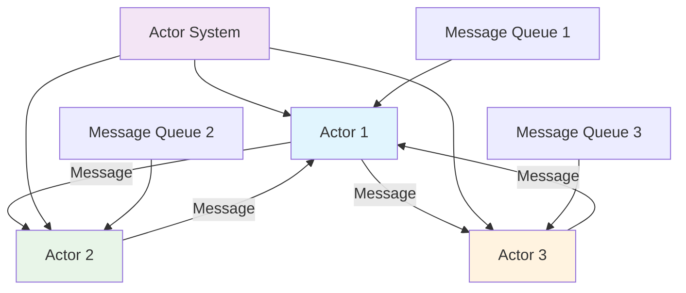
```mermaid
flowchart TD
    A[Actor 1] -->|Message| B[Actor 2]
    A -->|Message| C[Actor 3]
    B -->|Message| A
    C -->|Message| A
    D[Actor System] --> A
    D --> B
    D --> C
    
    E[Message Queue 1] --> A
    F[Message Queue 2] --> B
    G[Message Queue 3] --> C
    
    style A fill:#e1f5fe
    style B fill:#e8f5e8
    style C fill:#fff3e0
    style D fill:#f3e5f5
```

### 15. 事件循环模型 (Event Loop)
- **文件**: `event_loop_server.h`
- **特点**: 单线程事件循环，类似Node.js的实现方式
- **适用场景**: I/O密集型应用
- **优点**: 避免线程切换开销，内存占用少
- **缺点**: 单线程限制，CPU密集型任务会阻塞
- **实现**: 基于epoll/kqueue + 回调函数

**详细介绍**：
事件循环模型是一种单线程异步编程模式，通过一个无限循环来处理所有的I/O事件和回调函数。    
事件循环不断地检查事件队列，当有事件就绪时执行相应的回调函数。    
这种模型的核心思想是将所有阻塞操作转换为非阻塞的异步操作，通过事件通知机制来处理I/O完成。    
事件循环模型广泛应用于Node.js、Redis等高性能服务器中，特别适合I/O密集型应用。     
由于采用单线程设计，避免了多线程编程中的锁和同步问题，大大简化了编程复杂度。  

**实现架构**：
- 架构围绕事件循环、事件队列和回调函数构建。
- 事件循环是系统的核心，负责监听文件描述符、定时器和其他事件源。  
- 当事件发生时，相应的回调函数被添加到事件队列中，事件循环在每次迭代中处理队列中的所有回调，然后等待新的事件。
- 对于网络I/O，使用epoll/kqueue等高效的I/O多路复用机制。
- 定时器通过最小堆实现，支持高精度的定时任务。
- 所有的I/O操作都是非阻塞的，如果操作无法立即完成，会注册回调函数等待事件通知。

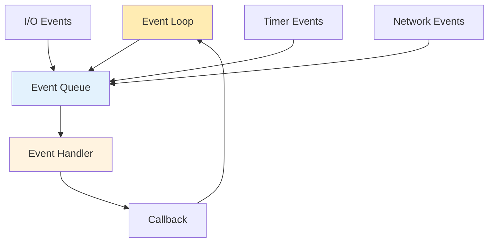
```mermaid
flowchart TD
    A[Event Loop] --> B[Event Queue]
    B --> C[Event Handler]
    C --> D[Callback]
    D --> A
    
    E[I/O Events] --> B
    F[Timer Events] --> B
    G[Network Events] --> B
    
    style A fill:#ffecb3
    style B fill:#e3f2fd
    style C fill:#fff3e0
```

### 16. 纤程/用户态线程 (Fiber/Green Thread)
- **文件**: `fiber_server.h`
- **特点**: 用户态调度的轻量级线程
- **适用场景**: 需要大量并发连接的场景
- **优点**: 创建成本极低，可创建数万个
- **缺点**: 需要实现复杂的调度器和栈管理
- **实现**: 需要实现用户态调度器和栈切换

**详细介绍**：
纤程（Fiber）是一种用户态的轻量级线程，也称为绿色线程或协作式线程。    
与操作系统线程不同，纤程的创建、销毁和调度都在用户空间完成，不需要内核参与。    
纤程之间采用协作式调度，只有当纤程主动让出控制权时才会发生切换，这避免了抢占式调度的开销和复杂性。    
每个纤程只需要很少的内存（通常几KB的栈空间），因此可以创建数十万个纤程而不会耗尽系统资源。    
纤程特别适合I/O密集型应用，当遇到阻塞操作时可以快速切换到其他纤程继续执行。    

**实现架构**：
- 架构基于用户态调度器和上下文切换机制构建。  
- 每个纤程包含独立的栈空间、寄存器状态和执行上下文。  
- 纤程调度器维护就绪队列和阻塞队列，负责纤程的创建、调度和销毁。  
- 当纤程遇到I/O操作时，会将自己加入阻塞队列并yield给调度器，调度器选择下一个就绪的纤程继续执行。
- I/O完成后，相应的纤程被移回就绪队列等待调度。
- 上下文切换通过汇编代码实现，保存和恢复CPU寄存器状态。
- 为了支持异步I/O，通常结合epoll等机制，在I/O就绪时唤醒对应的纤程。

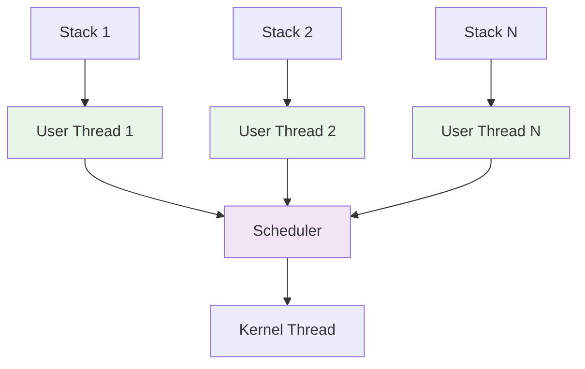
```mermaid
flowchart TD
    A[User Thread 1] --> B[Scheduler]
    C[User Thread 2] --> B
    D[User Thread N] --> B
    B --> E[Kernel Thread]
    
    F[Stack 1] --> A
    G[Stack 2] --> C
    H[Stack N] --> D
    
    style A fill:#e8f5e8
    style C fill:#e8f5e8
    style D fill:#e8f5e8
    style B fill:#f3e5f5
```

### 17. 工作窃取模型 (Work Stealing)
- **文件**: `work_stealing_server.h`
- **特点**: 每个线程有自己的任务队列，空闲时从其他线程窃取任务
- **适用场景**: CPU密集型任务的负载均衡
- **优点**: 自动负载均衡，减少线程空闲
- **缺点**: 实现复杂，可能存在缓存一致性问题
- **实现**: 基于无锁队列和线程池

**详细介绍**：
工作窃取模型是一种动态负载均衡的并行计算模式，每个工作线程维护自己的任务队列，当线程完成自己队列中的任务后，会尝试从其他线程的队列中"窃取"任务来执行。  
这种模型能够自动适应任务执行时间的不均匀性，避免某些线程空闲而其他线程过载的情况。  
工作窃取算法最初由Cilk项目提出，后来被广泛应用于Java的ForkJoinPool、Intel TBB等并行计算框架中。  
该模型特别适合处理递归分治算法和任务执行时间差异较大的场景。

**实现架构**：
- 架构基于多个工作线程和双端队列（deque）构建。  
- 每个工作线程拥有一个双端队列，新任务从队列头部添加，线程从头部取出任务执行（LIFO顺序，利用缓存局部性）。    
- 当线程的队列为空时，会随机选择其他线程的队列，从尾部窃取任务（FIFO顺序，减少冲突）。  
- 为了减少锁竞争，通常使用无锁的双端队列实现。  
- 任务可以在执行过程中产生新的子任务，这些子任务会被添加到当前线程的队列中。  
- 系统还包含一个全局任务队列，用于接收外部提交的任务。  

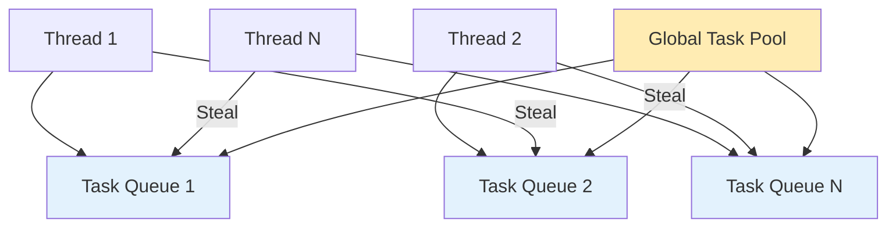
```mermaid
flowchart TD
    A[Thread 1] --> B[Task Queue 1]
    C[Thread 2] --> D[Task Queue 2]
    E[Thread N] --> F[Task Queue N]
    
    A -->|Steal| D
    C -->|Steal| F
    E -->|Steal| B
    
    G[Global Task Pool] --> B
    G --> D
    G --> F
    
    style B fill:#e3f2fd
    style D fill:#e3f2fd
    style F fill:#e3f2fd
    style G fill:#ffecb3
```

### 18. 生产者-消费者模型
- **文件**: `producer_consumer_server.h`
- **特点**: 专门的生产者线程接收连接，消费者线程处理请求
- **适用场景**: 明确区分接收和处理逻辑的场景
- **优点**: 职责分离，易于优化
- **缺点**: 队列可能成为瓶颈
- **实现**: 基于线程池 + 阻塞队列

**详细介绍**：
生产者-消费者模型是一种经典的并发设计模式，通过缓冲区将数据的生产和消费过程解耦。    
生产者负责生成数据并放入缓冲区，消费者从缓冲区取出数据进行处理。    
这种模型特别适合处理生产和消费速度不匹配的场景，缓冲区起到了削峰填谷的作用。    
在网络服务器中，可以将接收连接作为生产过程，处理请求作为消费过程，通过任务队列进行解耦。   
这种模型提高了系统的吞吐量和响应性，同时简化了系统设计。  

**实现架构**：
- 架构围绕生产者线程、消费者线程和共享缓冲区构建。缓冲区通常使用线程安全的队列实现，支持多个生产者和消费者并发访问。
- 生产者线程负责接收客户端连接，将连接信息封装成任务对象放入队列。
- 消费者线程从队列中取出任务，执行具体的业务逻辑。
- 为了避免缓冲区溢出或空转，通常使用条件变量进行同步：当缓冲区满时生产者等待，当缓冲区空时消费者等待。
- 可以配置多个生产者和消费者线程以提高并发性。缓冲区大小需要根据生产和消费速度进行调优。 

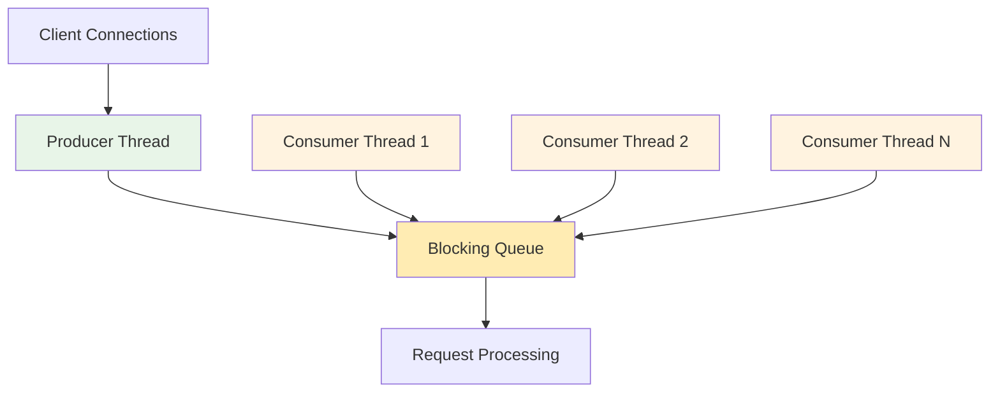
```mermaid
flowchart TD
    A[Producer Thread] --> B[Blocking Queue]
    C[Consumer Thread 1] --> B
    D[Consumer Thread 2] --> B
    E[Consumer Thread N] --> B
    
    F[Client Connections] --> A
    B --> G[Request Processing]
    
    style A fill:#e8f5e8
    style B fill:#ffecb3
    style C fill:#fff3e0
    style D fill:#fff3e0
    style E fill:#fff3e0
```

### 19. 半同步/半异步模型 (Half-Sync/Half-Async)
- **文件**: `half_sync_async_server.h`
- **特点**: 同步层处理协议，异步层处理I/O
- **适用场景**: 复杂协议处理
- **优点**: 结合同步和异步的优势
- **缺点**: 架构复杂，层间通信开销
- **实现**: 分层架构，异步I/O + 同步业务逻辑

**详细介绍**：
半同步/半异步模型是一种混合架构模式，将系统分为同步处理层和异步处理层，结合两种模式的优势。    
异步层负责高效的I/O处理，使用事件驱动的方式处理网络事件；同步层负责业务逻辑处理，使用传统的同步编程模型。    
两层之间通过队列进行通信，异步层将接收到的请求放入队列，同步层的工作线程从队列中取出请求进行处理。    
这种模型既保证了I/O处理的高效性，又保持了业务逻辑的简洁性，是实际项目中常用的架构模式。  

**实现架构**：
- 架构分为三个主要组件：异步I/O层、同步处理层和队列层。
- 异步I/O层使用单线程事件循环，基于epoll/kqueue等机制处理所有的网络I/O事件，包括接受连接、读取数据、发送响应。  
- 当完整的请求接收完成后，将请求数据封装成任务对象放入队列。
- 同步处理层包含多个工作线程，从队列中取出任务，使用传统的同步方式处理业务逻辑，如数据库访问、文件操作等。
- 处理完成后，将响应数据通过队列传回异步层进行发送。
- 队列层负责两层之间的通信，通常使用线程安全的队列实现。

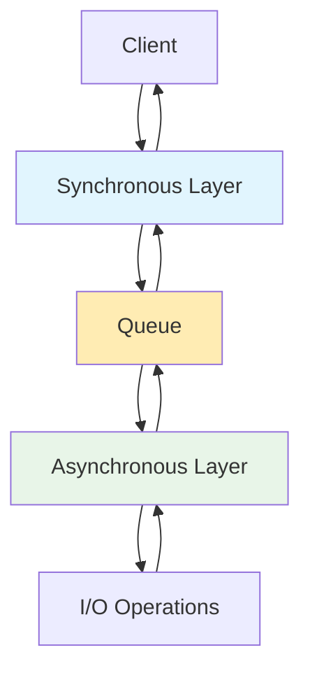
```mermaid
flowchart TD
    A[Client] --> B[Synchronous Layer]
    B --> C[Queue]
    C --> D[Asynchronous Layer]
    D --> E[I/O Operations]
    E --> D
    D --> C
    C --> B
    B --> A
    
    style B fill:#e1f5fe
    style C fill:#ffecb3
    style D fill:#e8f5e8
```

### 20. Proactor模式
- **文件**: `proactor_server.h`
- **特点**: 异步I/O完成后通知应用程序
- **适用场景**: Windows IOCP，异步I/O场景
- **优点**: 真正的异步I/O
- **缺点**: 平台依赖性强，实现复杂
- **实现**: 基于操作系统的异步I/O机制

**详细介绍**：
Proactor模式是一种基于异步I/O的设计模式，与Reactor模式相对应。    
在Reactor模式中，应用程序在I/O就绪时被通知并自己执行I/O操作，而在Proactor模式中，应用程序发起异步I/O操作，操作系统完成I/O后通知应用程序处理结果。  
这种模式真正实现了I/O操作的异步化，应用程序无需阻塞等待I/O完成，可以继续处理其他任务。  
Proactor模式特别适合I/O密集型应用，能够充分利用系统资源，提供更高的并发性能。  

**实现架构**：
- 架构围绕异步I/O操作和完成通知构建。
- 核心组件包括：Proactor负责管理异步操作和分发完成事件，AsynchronousOperationProcessor处理异步I/O操作，CompletionHandler处理I/O完成事件。
- 应用程序发起异步读写操作时，将操作提交给操作系统，同时注册完成处理器。操作系统在后台执行I/O操作，完成后将结果放入完成队列。
- Proactor从完成队列中取出事件，调用相应的完成处理器。
- 在Windows上可以使用IOCP（I/O Completion Ports），在Linux上可以使用io_uring或模拟实现。

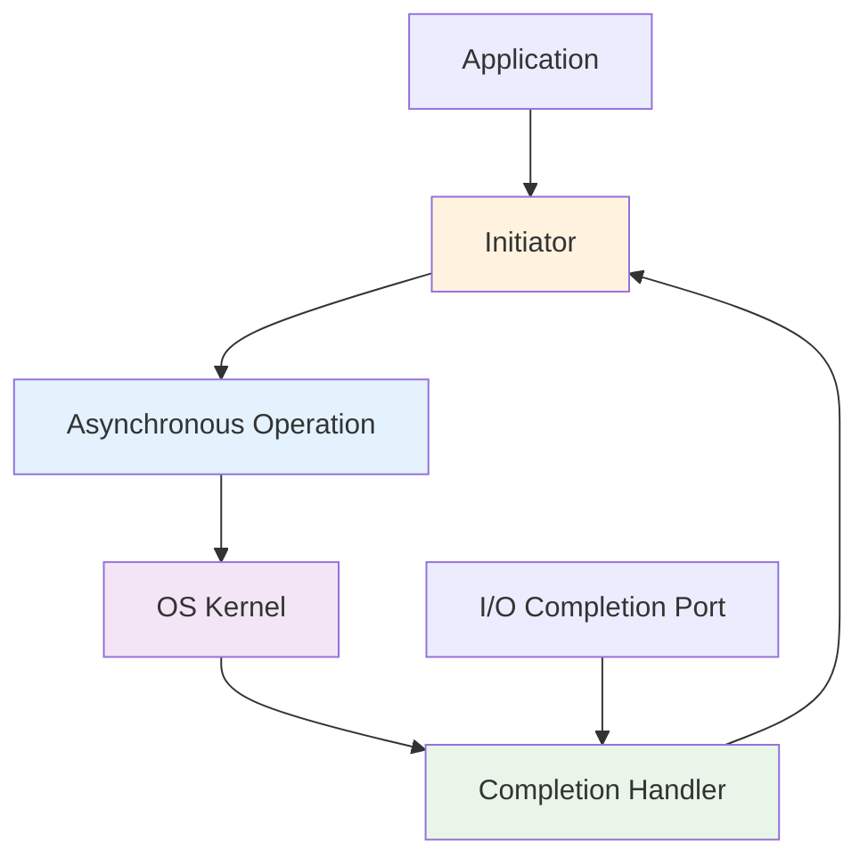
```mermaid
flowchart TD
    A[Initiator] --> B[Asynchronous Operation]
    B --> C[OS Kernel]
    C --> D[Completion Handler]
    D --> A
    
    E[Application] --> A
    F[I/O Completion Port] --> D
    
    style A fill:#fff3e0
    style B fill:#e3f2fd
    style C fill:#f3e5f5
    style D fill:#e8f5e8
```

### 21. 管道模型 (Pipeline)
- **文件**: `pipeline_server.h`
- **特点**: 请求处理分为多个阶段，每个阶段由不同线程处理
- **适用场景**: 复杂的请求处理流程
- **优点**: 流水线处理，提高吞吐量
- **缺点**: 阶段间同步复杂，可能存在瓶颈阶段
- **实现**: 多个线程池，每个处理一个阶段

**详细介绍**：
管道模型将请求处理过程分解为多个连续的阶段，每个阶段由专门的线程或线程池负责，形成流水线式的处理架构。    
请求按顺序通过各个阶段，每个阶段专注于特定的处理任务，如解析、验证、业务逻辑、响应生成等。
这种模型类似于工厂的流水线生产，能够显著提高系统的吞吐量，因为多个请求可以同时在不同阶段并行处理。    
管道模型特别适合处理步骤固定、可以分解的复杂业务流程，在数据处理、图像处理、编译器等领域应用广泛。  

**实现架构**：
- 架构由多个处理阶段和阶段间的缓冲队列组成，每个阶段包含一个或多个工作线程，专门负责特定的处理任务。
- 阶段之间通过线程安全的队列连接，前一阶段的输出作为后一阶段的输入。
- 请求从第一个阶段开始，依次通过所有阶段，最终产生响应。
- 每个阶段可以独立调优，包括线程数量、队列大小等参数。
- 为了避免某个阶段成为瓶颈，需要根据各阶段的处理能力合理配置资源。
- 可以实现阶段的动态扩缩容，根据负载情况调整线程数量。

```mermaid
flowchart TD
    A[Request] --> B[Stage 1 Thread Pool]
    B --> C[Stage 2 Thread Pool]
    C --> D[Stage 3 Thread Pool]
    D --> E[Stage N Thread Pool]
    E --> F[Response]
    
    G[Buffer 1] --> B
    H[Buffer 2] --> C
    I[Buffer 3] --> D
    J[Buffer N] --> E
    
    style B fill:#e1f5fe
    style C fill:#e8f5e8
    style D fill:#fff3e0
    style E fill:#f3e5f5
```

### 22. 混合模型
- **文件**: `hybrid_server.h`
- **特点**: 结合多种模型的优势
- **示例**:
  - Reactor + 线程池
  - Epoll + 协程
  - 多进程 + 多线程
- **适用场景**: 需要平衡各种性能指标
- **优点**: 灵活性高，可针对性优化
- **缺点**: 实现复杂，调试困难

**详细介绍**：
混合模型是一种综合性的并发架构，根据不同的业务需求和性能要求，在同一个系统中组合使用多种并发模型，可以在I/O处理层使用Reactor模型实现高效的事件处理，在业务逻辑层使用线程池模型保证处理能力，在数据访问层使用异步I/O模型提高数据库访问效率。    
这种模型允许开发者针对系统的不同部分选择最适合的并发策略，从而在整体上达到最优的性能表现。  
混合模型在大型企业级应用、微服务架构、分布式系统中应用广泛，是现代高性能服务器的主流架构选择。  

**实现架构**：
- 架构采用分层设计，每层根据其特点选择最适合的并发模型。
- 网络接入层通常使用事件驱动模型（如Epoll/Reactor）处理大量并发连接，保证高效的I/O处理。
- 请求路由层可能使用Actor模型实现请求的分发和负载均衡。
- 业务处理层根据业务特点选择合适的模型，如CPU密集型任务使用线程池，I/O密集型任务使用异步模型。
- 数据访问层可能结合连接池和异步I/O来优化数据库访问。
- 各层之间通过消息队列、事件总线或直接调用进行通信。
- 系统需要统一的监控和管理机制来协调各个模型的运行。

```mermaid
flowchart TD
    A[Model A] --> B[Hybrid Controller]
    C[Model B] --> B
    D[Model C] --> B
    B --> E[Unified Interface]
    
    F[Load Balancer] --> A
    F --> C
    F --> D
    
    style A fill:#e8f5e8
    style C fill:#fff3e0
    style D fill:#e1f5fe
    style B fill:#f3e5f5
```

## 编译和运行

### 编译
```bash
make
```

### 运行服务器
```bash
# 基本用法
./concurrency_server <model> [port]

# 示例
./concurrency_server thread_pool 8080
./concurrency_server epoll 9000
./concurrency_server reactor 8888
```

### 测试特定模型
```bash
# 测试线程池模型
make test-thread-pool

# 测试epoll模型
make test-epoll

# 测试所有模型（需要手动停止）
make test-single
make test-multi-thread
# ... 等等
```

### 性能测试
```bash
# 需要安装Apache Bench (ab)
make bench
```

## 客户端测试

可以使用多种工具测试服务器：

### 使用curl
```bash
curl http://localhost:8080/
```

### 使用Apache Bench
```bash
# 1000个请求，10个并发连接
ab -n 1000 -c 10 http://localhost:8080/
```

### 使用telnet
```bash
telnet localhost 8080
GET / HTTP/1.1
Host: localhost

```

## 性能对比

| 模型名称            | QPS   |
|---------------------|---------------:|
| single_process      | 19075.400      |
| multi_process       | 6904.800       |
| multi_thread        | 18137.834      |
| process_pool1       | 18337.299      |
| process_pool2       | 18589.268      |
| thread_pool         | 18483.166      |
| leader_follower     | 20180.701      |
| poll                | 18817.867      |
| kqueue              | 19096.133      |
| reactor             | 18945.467      |
| event_loop          | 19442.801      |
| work_stealing       | 8903.566       |
| actor               | 18681.500      |
| fiber               | 18994.268      |
| producer_consumer   | 18208.633      |
| proactor            | 18130.533      |

## 技术要点

### 1. 非阻塞I/O
大部分模型都使用了非阻塞I/O来提高性能：
```cpp
bool set_nonblocking(int fd) {
    int flags = fcntl(fd, F_GETFL, 0);
    if (flags == -1) return false;
    return fcntl(fd, F_SETFL, flags | O_NONBLOCK) != -1;
}
```

### 2. 信号处理
进程模型需要处理SIGCHLD信号避免僵尸进程：
```cpp
signal(SIGCHLD, SIG_IGN);
```

### 3. 套接字选项
使用SO_REUSEADDR避免地址重用问题：
```cpp
int opt = 1;
setsockopt(server_fd, SOL_SOCKET, SO_REUSEADDR, &opt, sizeof(opt));
```

### 4. 边缘触发 vs 水平触发
- **水平触发**: 只要条件满足就会触发事件
- **边缘触发**: 只在状态变化时触发事件

## 注意事项

1. **平台兼容性**: Epoll仅在Linux上可用，Kqueue仅在BSD/macOS上可用
2. **资源限制**: 注意系统的文件描述符限制和内存限制
3. **信号处理**: 多进程模型需要正确处理子进程信号
4. **线程安全**: 多线程模型需要注意共享资源的同步
5. **错误处理**: 网络编程中要充分考虑各种错误情况

## 扩展建议

1. **SSL/TLS支持**: 添加HTTPS支持
2. **HTTP解析**: 完整的HTTP协议解析
3. **配置文件**: 支持配置文件设置参数
4. **日志系统**: 添加完整的日志记录
5. **监控指标**: 添加性能监控和统计
6. **负载均衡**: 实现多服务器负载均衡

## 学习资源

- 《Unix网络编程》- W. Richard Stevens
- 《Linux高性能服务器编程》- 游双
- 《C++并发编程实战》- Anthony Williams
- 《高性能网络编程》相关资料

## 许可证

本项目仅供学习和研究使用。