# High Performance Server

这是一个高性能网络服务器实现集合，展示了多种现代 C++ 网络编程框架的使用方法。每个实现都是一个简单的 HTTP Echo 服务器，用于演示不同框架的特性和性能特点。

## 项目概览

本项目包含以下 9 种网络框架的实现：

| 框架 | 类型 | C++ 标准 | 特点 | 代表的开源项目 |
|------|------|----------|------|----------------|
| **libevent** | 事件驱动 | C++11 | 跨平台、轻量级、广泛使用 | Memcached, Tor, Chromium, tmux |
| **libev** | 事件驱动 | C++11 | 高性能、Linux 优化 | Node.js (早期版本), PowerDNS, Varnish |
| **libuv** | 事件驱动 | C++11 | Node.js 底层、跨平台 | Node.js, Julia, Luvit, pyuv |
| **Boost.Asio** | 异步 I/O | C++11 | 功能丰富、标准化 | Beast (HTTP/WebSocket), cpp-netlib, Riak |
| **ACE** | 面向对象 | C++17 | 企业级、模式丰富 | TAO (CORBA), OpenDDS, JAWS Web Server |
| **Seastar** | 无共享 | C++17 | 极高性能、现代设计 | ScyllaDB, Redpanda, Seastar HTTP Server |
| **Wangle** | 异步 | C++17 | Facebook 开源、Pipeline 架构 | Proxygen, McRouter, Facebook Services |
| **Proxygen** | HTTP 专用 | C++17 | Facebook HTTP 库 | Facebook Web Services, Instagram API |
| **Mongoose** | 嵌入式 | C++11 | 轻量级、易集成 | ESP32 项目, IoT 设备, 嵌入式 Web 服务器 |

## 各框架详细架构

## 各框架详细架构

### 1. libevent - 事件驱动架构

**特点**: 
- **跨平台兼容性**: 支持 Linux (epoll)、macOS (kqueue)、Windows (IOCP) 等多种平台
- **多种 I/O 多路复用**: 自动选择最优的 I/O 机制 (epoll/kqueue/select)
- **缓冲事件处理**: 内置缓冲区管理，简化网络编程
- **HTTP 支持**: 内置 HTTP 服务器和客户端功能
- **定时器支持**: 高精度定时器和超时处理
- **线程安全**: 支持多线程环境下的事件处理
- **内存管理**: 高效的内存池和缓冲区管理

**底层架构**:
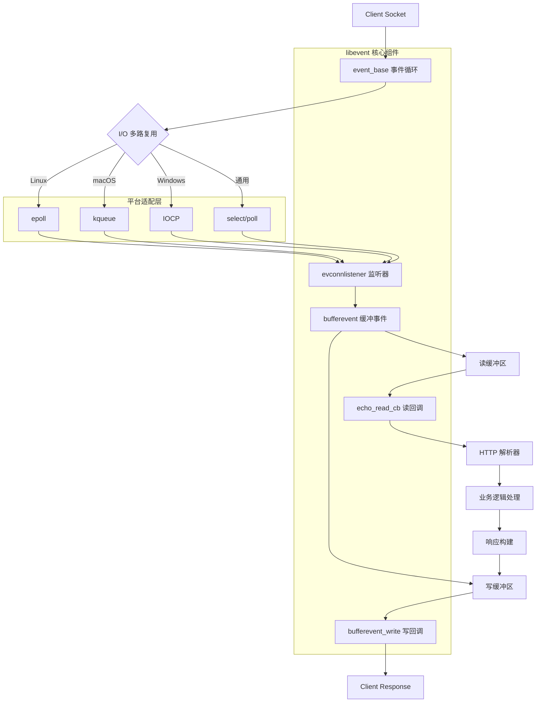

**核心组件**:
- `event_base`: 事件循环核心，管理所有事件
- `evconnlistener`: 连接监听器，处理新连接
- `bufferevent`: 缓冲事件处理，自动管理读写缓冲区
- 回调函数: `echo_read_cb`, `echo_event_cb`
- 平台适配: 自动选择最优 I/O 多路复用机制

### 2. libev - 高性能事件循环

**特点**: 
- **极致性能**: 专为高性能设计，最小化系统调用开销
- **Linux 优化**: 深度优化 epoll 性能，支持 Linux 特有功能
- **轻量级设计**: 代码简洁，内存占用极小
- **多种事件类型**: 支持 I/O、定时器、信号、子进程等事件
- **嵌套事件循环**: 支持事件循环的嵌套调用
- **高精度定时器**: 基于红黑树的高效定时器实现
- **信号处理**: 安全的异步信号处理机制

**底层架构**:
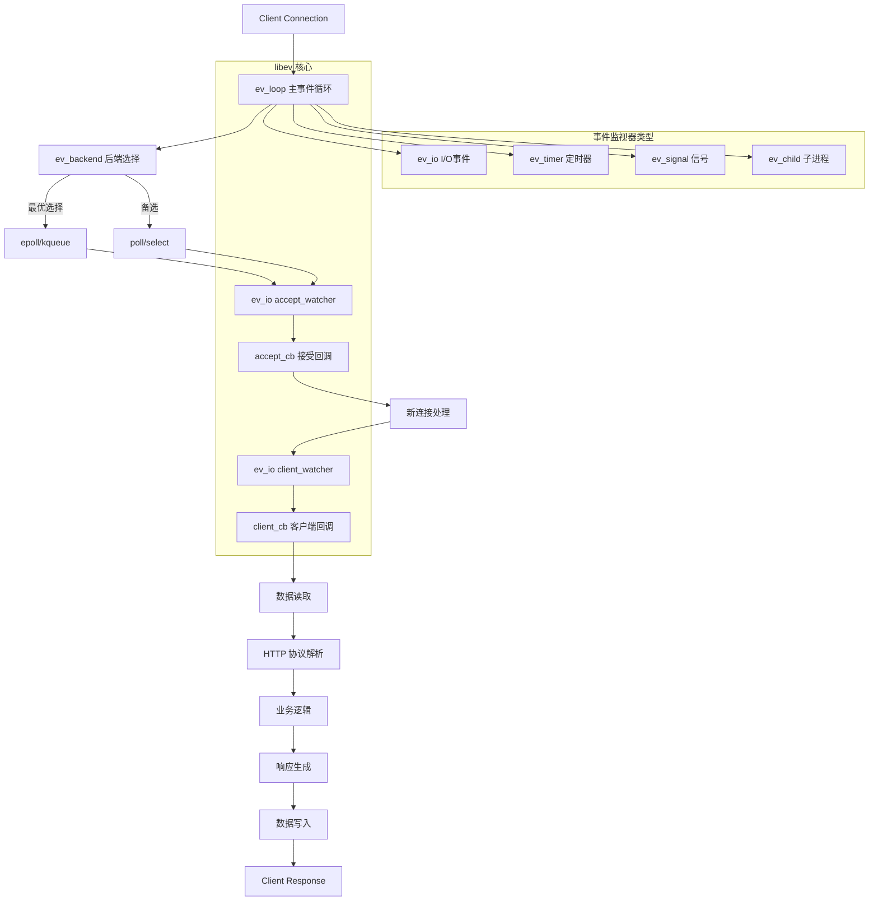

**核心组件**:
- `ev_loop`: 高性能事件循环，支持多种后端
- `ev_io`: I/O 事件监视器，监控文件描述符
- `ev_timer`: 高精度定时器，基于红黑树实现
- `accept_cb`: 连接接受回调，处理新连接
- `client_cb`: 客户端数据处理回调

### 3. libuv - 跨平台异步 I/O

**特点**: 
- **Node.js 底层**: Node.js 的核心依赖，经过大规模生产验证
- **跨平台统一**: 统一的 API 抽象不同平台的异步 I/O
- **线程池**: 内置线程池处理文件 I/O 和 CPU 密集任务
- **异步文件操作**: 完整的异步文件系统 API
- **进程管理**: 跨平台的进程创建和管理
- **网络抽象**: 高级网络 API，支持 TCP、UDP、管道
- **事件循环**: 单线程事件循环 + 多线程工作池

**底层架构**:
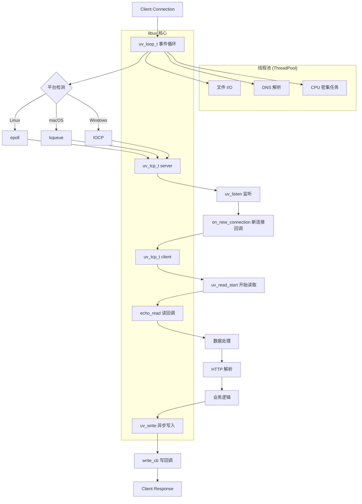

**核心组件**:
- `uv_loop_t`: 跨平台事件循环，统一不同平台的异步机制
- `uv_tcp_t`: TCP 句柄，封装网络连接
- `uv_read_start`: 开始异步读取数据
- `uv_write`: 异步写入数据，支持批量写入
- 线程池: 处理阻塞操作，避免阻塞主线程

### 4. Boost.Asio - 异步网络编程

**特点**: 
- **C++ 标准候选**: 设计现代，可能成为 C++ 标准库的一部分
- **类型安全**: 强类型系统，编译时错误检查
- **协程支持**: 支持 C++20 协程，简化异步编程
- **可扩展性**: 支持自定义 I/O 对象和协议
- **SSL/TLS**: 内置 SSL/TLS 支持
- **定时器**: 高精度定时器和截止时间
- **信号处理**: 异步信号处理机制

**底层架构**:
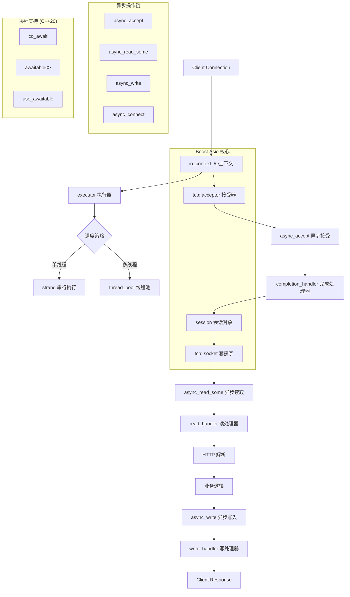

**核心组件**:
- `io_context`: I/O 执行上下文，管理异步操作
- `tcp::acceptor`: TCP 接受器，监听新连接
- `session`: 会话管理类，封装连接生命周期
- 异步操作: `async_accept`, `async_read_some`, `async_write`
- 协程支持: C++20 协程集成

### 5. ACE - 自适应通信环境

**特点**: 
- **企业级框架**: 经过大型企业系统验证的成熟框架
- **设计模式丰富**: 实现了多种网络编程设计模式
- **高度可配置**: 支持编译时和运行时配置
- **跨平台**: 支持 40+ 种操作系统和编译器
- **面向对象**: 完全面向对象的设计
- **组件化**: 模块化设计，可按需使用
- **性能优化**: 针对高并发场景的优化

**底层架构**:
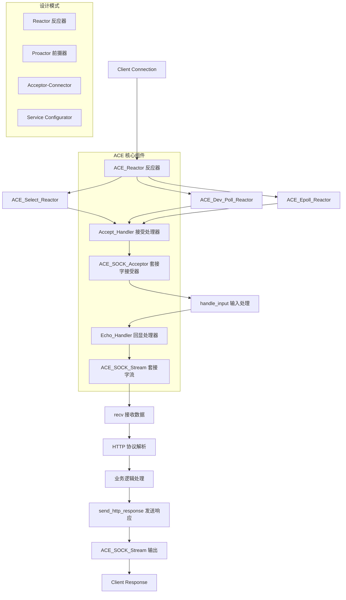

**核心组件**:
- `ACE_Reactor`: 反应器模式核心，支持多种实现
- `ACE_Event_Handler`: 事件处理器基类
- `ACE_SOCK_Acceptor`: 套接字接受器
- `ACE_SOCK_Stream`: 套接字流，封装网络通信
- 设计模式: Reactor、Proactor、Acceptor-Connector

### 6. Seastar - 无共享架构

**特点**: 
- **无共享设计**: 每个 CPU 核心独立运行，避免锁竞争
- **用户态网络栈**: 绕过内核，直接操作网络硬件 (DPDK)
- **协程支持**: 基于 future/promise 的协程模型
- **内存管理**: 自定义内存分配器，减少内存碎片
- **CPU 亲和性**: 严格的 CPU 核心绑定
- **零拷贝**: 最小化数据拷贝操作
- **现代 C++**: 大量使用 C++14/17 特性

**底层架构**:
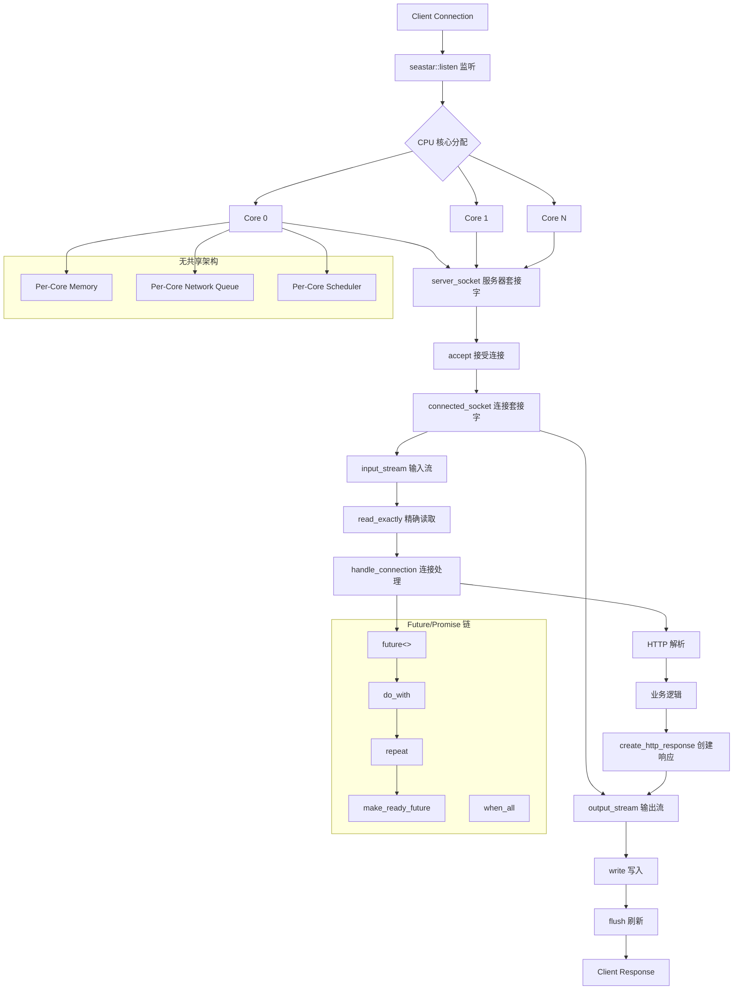

**核心组件**:
- `app_template`: 应用程序模板，管理应用生命周期
- `server_socket`: 服务器套接字，支持多核心
- `connected_socket`: 连接套接字，封装网络连接
- `future<>`: 异步操作结果，支持链式调用
- 无共享架构: 每核心独立的内存、网络队列、调度器

### 7. Wangle - Pipeline 架构

**特点**: 
- **Pipeline 设计**: 模块化的请求处理管道
- **Facebook 生产**: Facebook 内部大规模使用
- **类型安全**: 强类型的 Pipeline 组件
- **可组合性**: 灵活的处理器组合
- **协议无关**: 支持多种网络协议
- **负载均衡**: 内置负载均衡和连接池
- **SSL/TLS**: 完整的 SSL/TLS 支持

**底层架构**:
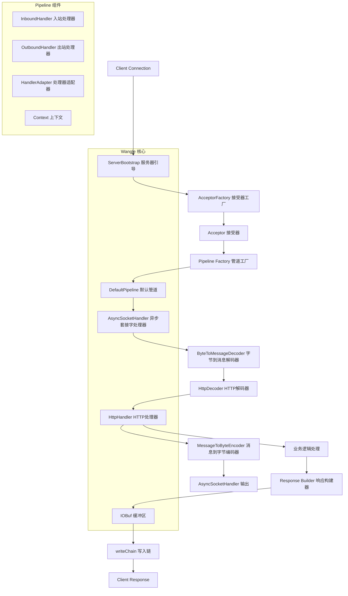

**核心组件**:
- `ServerBootstrap`: 服务器引导程序，配置服务器
- `Pipeline`: 处理管道，链式处理请求
- `ByteToMessageDecoder`: 字节到消息解码器
- `HandlerAdapter`: 处理器适配器，连接不同类型的处理器
- `IOBuf`: 高效的缓冲区管理

### 8. Proxygen - HTTP 专用库

**特点**: 
- **HTTP 专用**: 专为 HTTP/1.1 和 HTTP/2 优化
- **Facebook 开源**: Facebook 内部 HTTP 服务的基础
- **HTTP/2 支持**: 完整的 HTTP/2 实现，包括服务器推送
- **流式处理**: 支持大文件的流式上传下载
- **压缩支持**: 内置 gzip、deflate 压缩
- **WebSocket**: 完整的 WebSocket 支持
- **性能监控**: 内置性能指标和监控

**底层架构**:
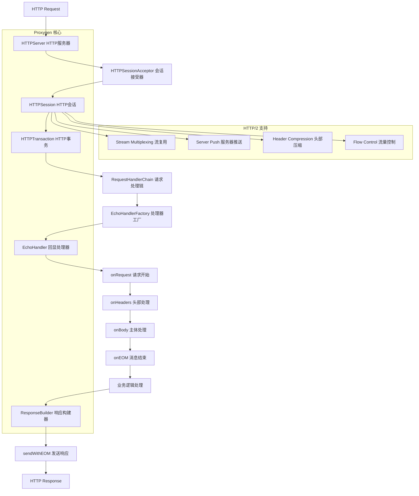

**核心组件**:
- `HTTPServer`: HTTP 服务器，支持 HTTP/1.1 和 HTTP/2
- `RequestHandler`: 请求处理器，处理 HTTP 请求生命周期
- `RequestHandlerFactory`: 处理器工厂，创建请求处理器
- `ResponseBuilder`: 响应构建器，构建 HTTP 响应
- HTTP/2 特性: 流复用、服务器推送、头部压缩

### 9. Mongoose - 嵌入式 Web 服务器

**特点**: 
- **轻量级**: 单文件实现，易于集成
- **嵌入式友好**: 适合资源受限的环境
- **多协议支持**: HTTP、WebSocket、MQTT、CoAP
- **跨平台**: 支持嵌入式系统、桌面、服务器
- **零依赖**: 不依赖外部库
- **事件驱动**: 基于事件的异步处理
- **内置功能**: 文件服务、CGI、SSI 支持

**底层架构**:
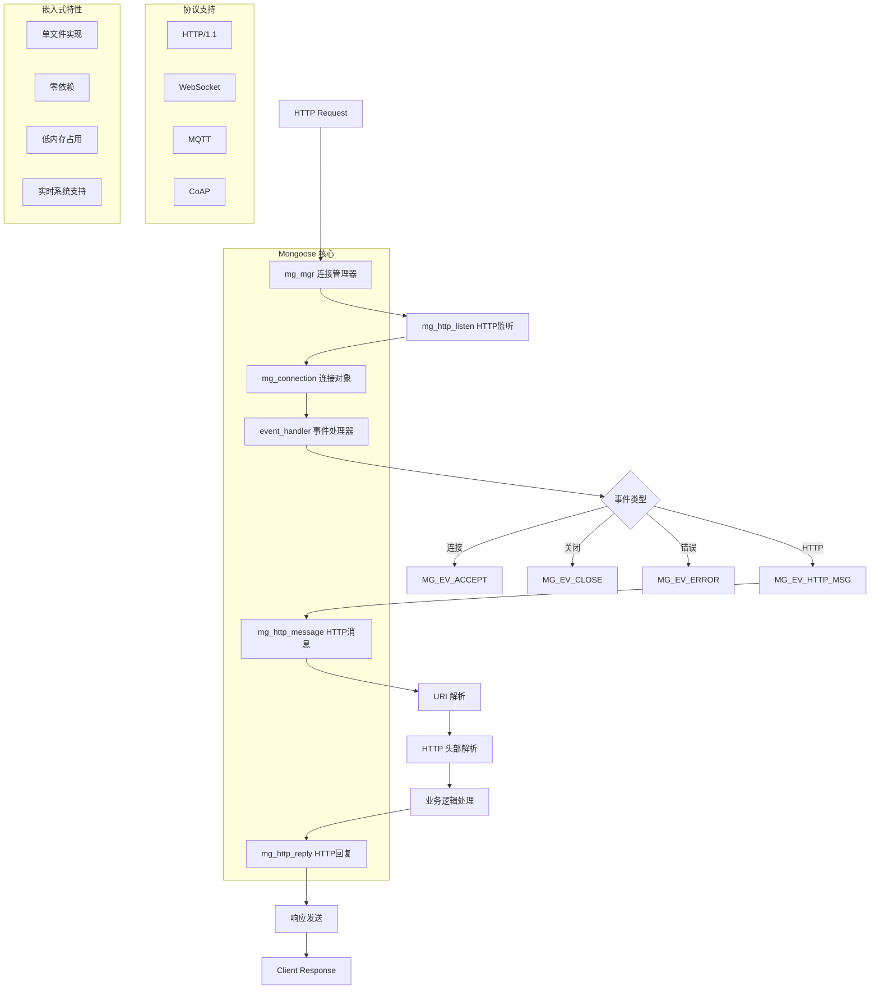

**核心组件**:
- `mg_mgr`: 连接管理器，管理所有网络连接
- `mg_connection`: 连接对象，封装单个网络连接
- `mg_http_listen`: HTTP 监听，启动 HTTP 服务
- `mg_http_reply`: HTTP 响应，发送 HTTP 回复
- 多协议: HTTP、WebSocket、MQTT、CoAP 统一接口

## 性能对比

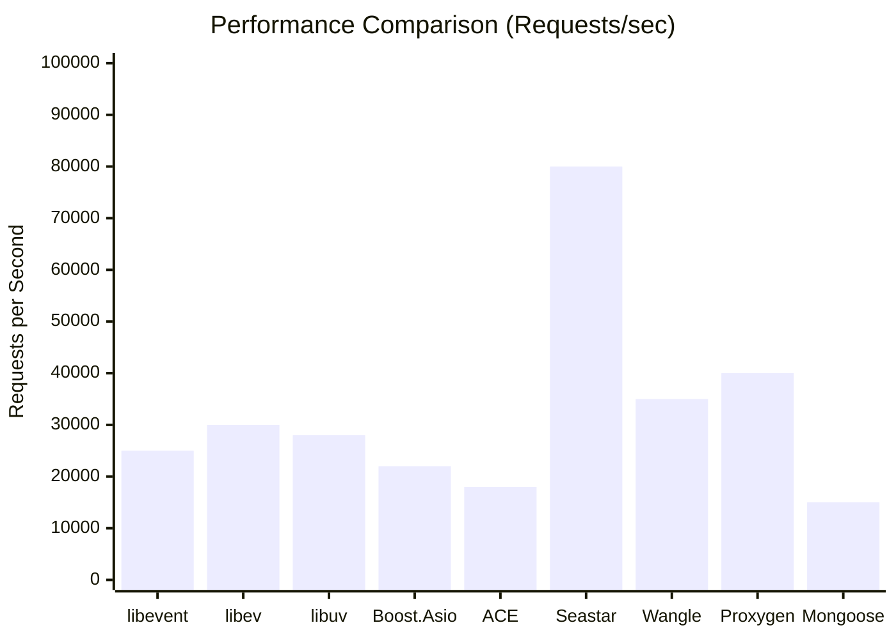

## 快速开始

### 环境要求

- macOS 或 Linux
- C++11/17 编译器 (GCC 7+ 或 Clang 5+)
- Bazel 6.0+

### 安装 Bazel

```bash
# macOS
brew install bazel

# Ubuntu/Debian
sudo apt install apt-transport-https curl gnupg
curl -fsSL https://bazel.build/bazel-release.pub.gpg | gpg --dearmor > bazel.gpg
sudo mv bazel.gpg /etc/apt/trusted.gpg.d/
echo "deb [arch=amd64] https://storage.googleapis.com/bazel-apt stable jdk1.8" | sudo tee /etc/apt/sources.list.d/bazel.list
sudo apt update && sudo apt install bazel

# CentOS/RHEL
sudo dnf copr enable vbatts/bazel
sudo dnf install bazel
```

### 安装依赖

```bash
# macOS
brew install libuv libevent libev boost
brew install folly wangle proxygen  # 可选

# Ubuntu/Debian
sudo apt-get install libuv1-dev libevent-dev libev-dev libboost-all-dev

# CentOS/RHEL
sudo yum install libuv-devel libevent-devel libev-dev boost-devel
```

### 构建项目

```bash
# 构建所有服务器
./build_all_bazel.sh

# 或使用 Bazel 直接构建
bazel build //...

# 构建特定服务器
bazel build //libevent:libevent_echo_server
bazel build //boost_asio:boost_asio_echo_server
bazel build //seastar:seastar_echo_server
bazel build //libev:libev_echo_server
bazel build //libuv:libuv_echo_server
bazel build //mongoose:mongoose_echo_server
```

### 运行服务器

```bash
# 运行 libevent 服务器
bazel run //libevent:libevent_echo_server

# 运行 Seastar 服务器
bazel run //seastar:seastar_echo_server

# 运行 Boost.Asio 服务器
bazel run //boost_asio:boost_asio_echo_server

# 运行 libev 服务器
bazel run //libev:libev_echo_server

# 运行 libuv 服务器
bazel run //libuv:libuv_echo_server

# 运行 Mongoose 服务器
bazel run //mongoose:mongoose_echo_server
```

### 测试服务器

```bash
# 使用 curl 测试
curl -X GET http://localhost:8080/test
```

## Docker 支持

```bash
# 构建镜像
docker build -t high-performance-server .

# 运行容器
docker run -p 8080:8080 high-performance-server

# 使用 docker-compose
docker-compose up
```

## 框架选择指南

### 选择建议

| 场景 | 推荐框架 | 理由 |
|------|----------|------|
| **高并发 Web 服务** | Seastar, Proxygen | 极高性能，现代架构 |
| **跨平台应用** | Boost.Asio, libuv | 标准化，跨平台支持好 |
| **嵌入式系统** | Mongoose, libevent | 轻量级，资源占用少 |
| **企业级应用** | ACE, Boost.Asio | 功能丰富，稳定可靠 |
| **微服务架构** | Wangle, Proxygen | Pipeline 设计，易扩展 |
| **学习研究** | libevent, libev | 代码简洁，易理解 |

### 技术特点对比

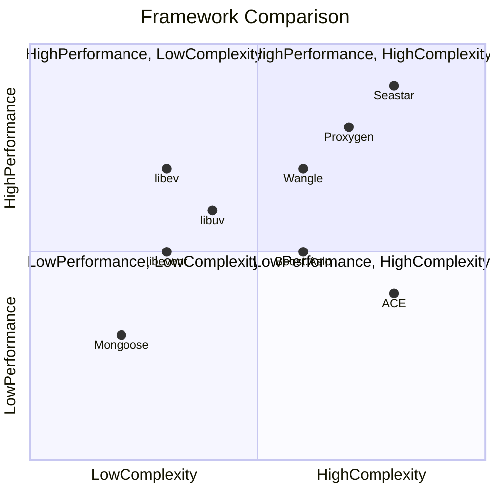

## 相关资源

- [libevent 官方文档](https://libevent.org/)
- [libev 官方文档](http://software.schmorp.de/pkg/libev.html)
- [libuv 官方文档](https://libuv.org/)
- [Boost.Asio 文档](https://www.boost.org/doc/libs/release/libs/asio/)
- [ACE 官方网站](http://www.dre.vanderbilt.edu/~schmidt/ACE.html)
- [Seastar 官方文档](https://seastar.io/)
- [Wangle GitHub](https://github.com/facebook/wangle)
- [Proxygen GitHub](https://github.com/facebook/proxygen)
- [Mongoose 官方文档](https://mongoose.ws/)
- https://docs.seastar.io/master/tutorial.html
- https://zhuanlan.zhihu.com/p/30738569
- https://blog.csdn.net/Rong_Toa/article/details/108193340
- https://www.cnblogs.com/ahfuzhang/p/15824213.html《Memory Barriers: a Hardware View for Software Hackers》
-