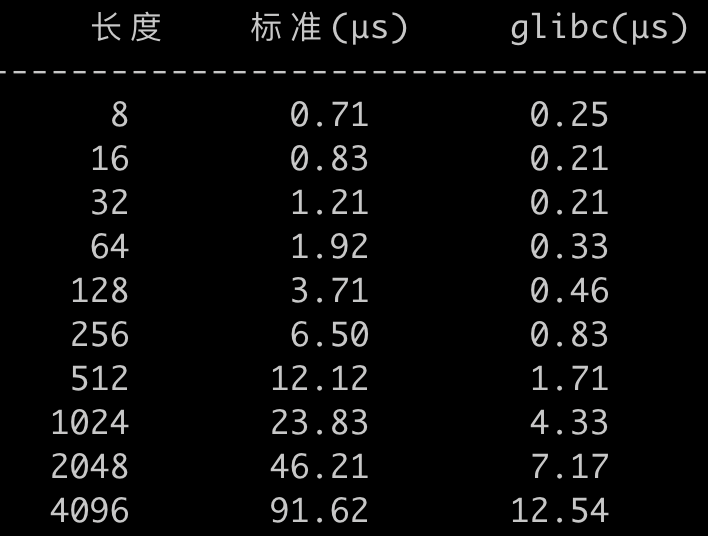
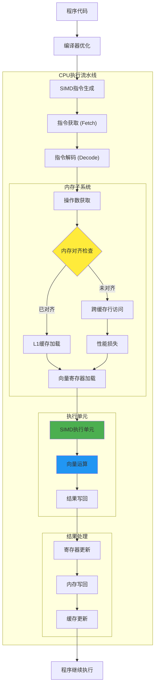
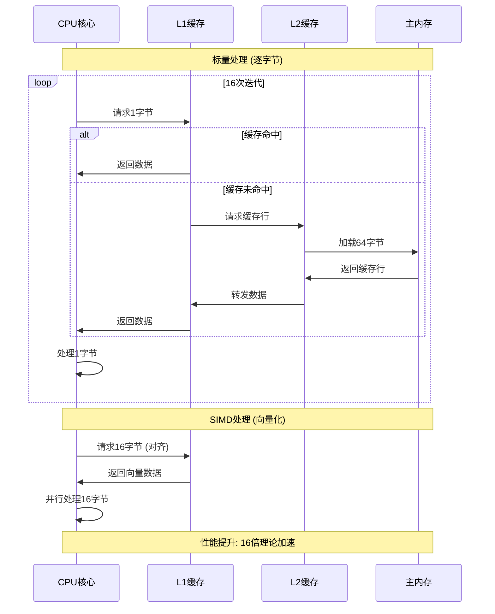
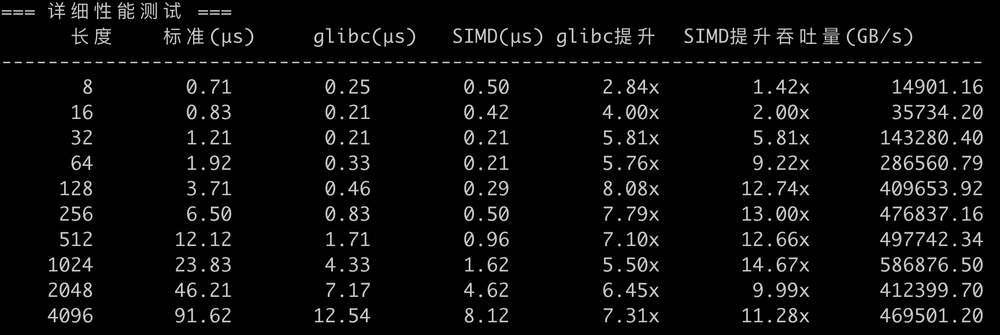

# 如何使用提升 strlen 的性能？

很多开发觉得实现 strlen 是一件很简单的事情，可能很快写出如下代码：
```cpp
inline size_t strlen_standard(const char* str) {
    if (!str) return 0;
    const char* s = str;
    while (*s) ++s;
    return s - str;
}
```
以上代码没错，简单，时间复杂度 O(n)，但是我们用 glibc 的版本和当前实现对比，发现性能有 4-6 倍的差异，数据如下：



随着字符串的长度增加，`strlen_standard` 耗时线性增长，但是 glibc 的版本耗时增长相对较慢，差异在 4-6 倍。

## 为什么 `glibc` 中的 `strlen` 性能这么好？

### 1. 内存对齐优化

```cpp
// 处理前几个字符直到对齐
for (char_ptr = str; 
     ((unsigned long int) char_ptr & (sizeof(longword) - 1)) != 0; 
     ++char_ptr) {
    if (*char_ptr == '\0')
        return char_ptr - str;
}
```

**优化原理：**
- 确保后续的内存访问都是对齐的（通常是8字节或16字节对齐）
- 对齐的内存访问在现代CPU上性能更好，避免跨缓存行访问
- 减少内存访问的延迟和提高吞吐量

### 2. 快速检测`\0`

```cpp
// 设置魔数用于 \0 检测
himagic = 0x80808080UL;
lomagic = 0x01010101UL;
if (sizeof(longword) > 4) {
    himagic = ((himagic << 32) | himagic);  // 64位: 0x8080808080808080
    lomagic = ((lomagic << 32) | lomagic);  // 64位: 0x0101010101010101
}
...
if (((longword - lomagic) & ~longword & himagic) != 0) {
    // 发现 `\0`
}
```

**优化原理：**
比如：原始数据 0x41424300  ('A','B','C',\0)   
lomagic:   0x01010101  
himagic:   0x80808080  

步骤1: 0x41424300 - 0x01010101 = 0x404241FF  
步骤2: ~0x41424300 = 0xBEBDBCFF  
步骤3: 0x404241FF & 0xBEBDBCFF & 0x80808080 = 0x00000080  

结果非零，说明存在 `\0`，不需要每个字符都检测  

### 3. 批处理

```cpp
for (;;) {
    longword = *longword_ptr++;  // 一次读取8字节（64位系统）
    if (((longword - lomagic) & ~longword & himagic) != 0) {
        // 处理找到的零字节
    }
}
```

**优化原理：**
- **并行处理**：一次检测8个字节（64位系统）或4个字节（32位系统）
- **减少循环次数**：相比逐字节检测，循环次数减少8倍
- **更好的指令流水线**：减少分支预测失败

## 使用 SIMD 优化 strlen，能提升多少性能？

使用 `glibc` 能做到批处理 `8` 个字节，随着字符增大，`glibc` 最大性能也就提升 8 倍，但是如果需要批处理更多的数据该怎么优化呢？使用 `SIMD`。

### 什么是 SIMD
SIMD（Single Instruction, Multiple Data，单指令多数据）是一种并行计算架构，允许一条指令同时对多个数据元素执行相同的操作。这种技术是现代CPU提高计算性能的重要手段之一。

### SIMD的基础概念

- **向量化计算**: 将标量操作转换为向量操作，一次处理多个数据
- **数据并行**: 同一操作同时应用于多个数据元素
- **指令级并行**: 在单个CPU周期内执行多个相同操作

### SIMD vs 传统标量处理

```
传统标量处理:
for (int i = 0; i < 16; i++) {
    result[i] = a[i] + b[i];  // 16次独立的加法操作
}

SIMD向量处理:
__m128i va = _mm_load_si128(a);     // 加载16个字节
__m128i vb = _mm_load_si128(b);     // 加载16个字节  
__m128i vr = _mm_add_epi8(va, vb);  // 一条指令完成16个加法
_mm_store_si128(result, vr);        // 存储结果
```

#### 使用示例

```cpp
// x86 SSE2 示例
__m128i a = _mm_load_si128((__m128i*)ptr1);
__m128i b = _mm_load_si128((__m128i*)ptr2);
__m128i result = _mm_add_epi8(a, b);
_mm_store_si128((__m128i*)output, result);

// ARM NEON 示例
uint8x16_t a = vld1q_u8(ptr1);
uint8x16_t b = vld1q_u8(ptr2);
uint8x16_t result = vaddq_u8(a, b);
vst1q_u8(output, result);

// RISC-V Vector 示例
vuint8m1_t a = vle8_v_u8m1(ptr1, vl);
vuint8m1_t b = vle8_v_u8m1(ptr2, vl);
vuint8m1_t result = vadd_vv_u8m1(a, b, vl);
vse8_v_u8m1(output, result, vl);
```

## SIMD的底层工作原理

### 1. 寄存器结构

```
SSE2 XMM寄存器 (128位):
┌─────────────────────────────────────────────────────────────────┐
│  Byte15 │ Byte14 │ ... │ Byte2 │ Byte1 │ Byte0 │  (16个字节)    │
└─────────────────────────────────────────────────────────────────┘

AVX2 YMM寄存器 (256位):
┌─────────────────────────────────────────────────────────────────┐
│           高128位 (XMM高位)        │        低128位 (XMM)        │
│  Byte31-16                        │       Byte15-0              │
└─────────────────────────────────────────────────────────────────┘
```

#### SIMD指令执行流程



#### 内存访问模式对比



### 优化后的 `strlen` 代码

参考 glibc 的代码，使用 SIMD 指令对 strlen 做代码改造如下（一次取 16 个字节）： 

```cpp
// ARM64 NEON版本 - 优化版
inline size_t strlen_neon(const char* str) {
    if (!str) return 0;
    const char* ptr = str;
    
    // 处理未对齐的前缀
    while (((uintptr_t)ptr & 15) && *ptr) {
        ptr++;
    }
    
    if (!*ptr) return ptr - str;
    
    // 16字节对齐后，使用NEON并行处理
    const uint8x16_t zero = vdupq_n_u8(0);
    
    while (true) {
        uint8x16_t chunk = vld1q_u8(reinterpret_cast<const uint8_t*>(ptr));
        uint8x16_t cmp = vceqq_u8(chunk, zero);
        
        // 使用更高效的方法检查零字节
        uint64x2_t paired = vreinterpretq_u64_u8(cmp);
        uint64_t combined = vgetq_lane_u64(paired, 0) | vgetq_lane_u64(paired, 1);
        
        if (combined) {
            // 使用位操作快速找到第一个零字节位置
            uint16x8_t cmp16 = vreinterpretq_u16_u8(cmp);
            uint64_t mask = vget_lane_u64(vreinterpret_u64_u16(vorr_u16(vget_low_u16(cmp16), vget_high_u16(cmp16))), 0);
            
            for (int i = 0; i < 16; i++) {
                if (ptr[i] == 0) {
                    return ptr - str + i;
                }
            }
        }
        ptr += 16;
    }
}
```

**性能如下：**

